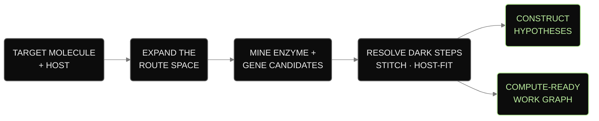
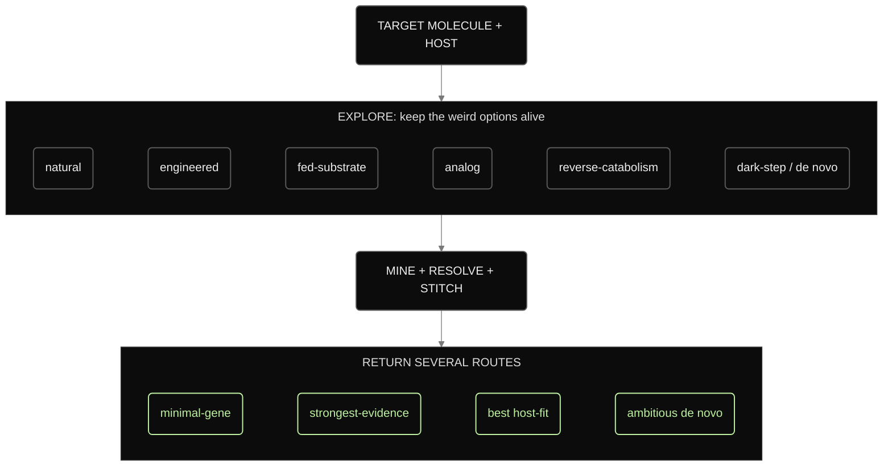
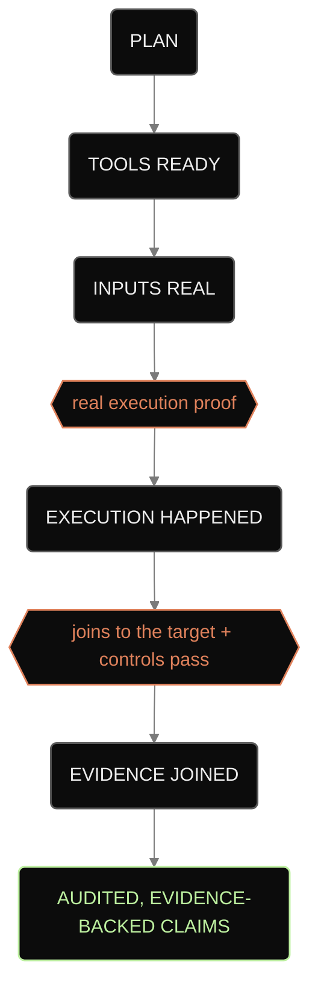
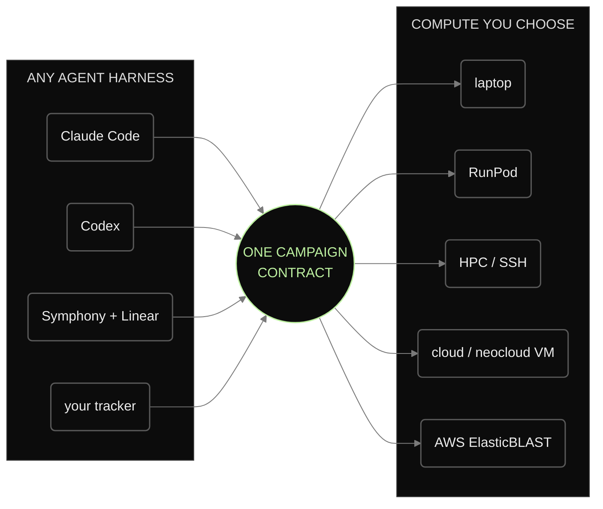
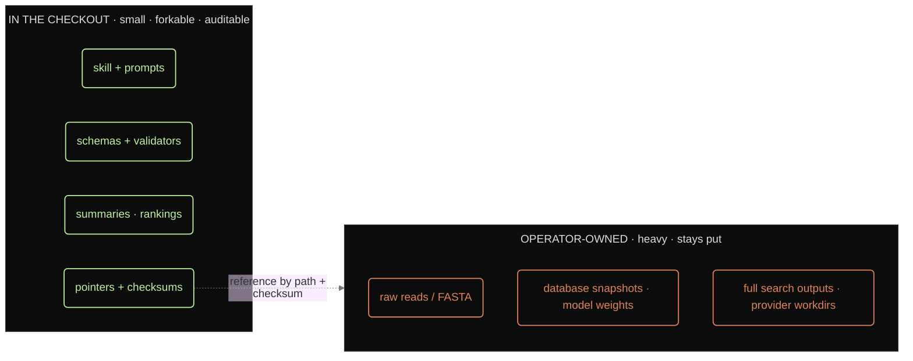

# BioSymphony BioProspector


**A portable skill repo for biosynthetic pathway campaigns: route families, enzyme and gene search lanes, pathway options, construct-oriented work lanes, and compute-ready plans.**

BioProspector helps agents and agentic harnesses tackle long-horizon bioprospecting work. You describe the target molecule, host, constraints, and available compute. The skill gives the agent a campaign contract, ledgers, validators, issue templates, and review artifacts it can use to plan the work and keep later workers aligned.

The repo works from a laptop and can prepare heavier search lanes for RunPod, HPC, a cloud VM, or AWS ElasticBLAST when the campaign calls for it. It fits Claude Code, Codex, Symphony with Linear, and tracker-neutral queues. One campaign contract gives each agent the same target, boundaries, work lanes, and artifact expectations.

Three public example campaigns ship ready to run: **vanillin**, **nootkatone**, and **Huperzine A**. All are target-swappable for your own molecule.



## What Agents Get

A campaign gives an agent concrete work products:

- **Expands the route space:** natural, engineered, fed-substrate, analog, reverse-catabolism, dark-step, and de novo families, so the agent weighs real alternatives early.
- **Reasons about the unknown:** missing chemistry, unknown genes, and hidden multi-gene steps become explicit, testable hypotheses with the counterevidence attached.
- **Mines every reaction step:** shortlist the genes, summarize the domains, keep the source pointers, and record what was rejected so the next agent skips known dead ends.
- **Returns several routes:** the minimal-gene option, the strongest-evidence option, the best host-fit, and an ambitious one, each with its trade-offs.
- **Keeps result boundaries explicit:** planning, execution, search output, controls, and claim records stay separate, so downstream workers know what is ready and what still needs review.





The public examples are planning-only. They stop before any validated claim, because no real search has run.

## Where It Runs

Start on a laptop. Escalate one lane to heavier compute only when the science calls for it, and only after you approve the budget and credentials outside this repo. Switch agent harnesses without rewriting the campaign.



## What's in the Checkout, and What Stays Out

The checkout stays small, forkable, and auditable. It carries the skill, prompts, schemas, validators, and the compact summaries and rankings a campaign produces. The heavy data (raw reads, database snapshots, model weights, full search outputs) stays in storage you own. The checkout holds pointers and checksums into it.



```text
skills/bioprospector/   the skill: SKILL.md, CLIs, example campaigns, references
docs/                   user and agent documentation (start with QUICKSTART.md)
templates/              issue templates the agent draws from
demos/                  demo maps and sample outputs
schemas/                shared campaign + ledger contracts
src/                    installable bioprospector CLI
tests/                  validators and contract checks
```

## Start in Five Minutes

You don't need to run any of this yourself; your agent does. These confirm the skill installed cleanly and show what it produces:

```bash
python3 skills/bioprospector/scripts/bioprospector_doctor.py --include-runtime
make local-demo
```

In about five minutes you get a campaign on the Huperzine A example: the explored route space, mined candidates with source pointers, a ranked set of routes, a metadata-only gene-cluster plan, and a compact review package, with every claim labeled for how far the evidence goes.

New here? Start with [`docs/QUICKSTART.md`](docs/QUICKSTART.md) and [`docs/WORKFLOWS.md`](docs/WORKFLOWS.md). To run a campaign for your own molecule, see [`docs/FIRST_CAMPAIGN.md`](docs/FIRST_CAMPAIGN.md). Copy-paste agent prompts live in [`docs/AGENT_PLAYBOOK.md`](docs/AGENT_PLAYBOOK.md).

## Talk to Your Agent

Once the skill is installed, describe the campaign and the agent runs it:

```text
Use the bioprospector skill in this checkout. Run doctor, keep everything local,
and start a campaign for <target molecule> in <host>. Explore the route space,
draft construct-oriented work lanes, and return a short review package under .runtime/.
```

```text
Use BioProspector to resolve the dark steps in the Huperzine A example: turn the
unknown chemistry into single-gene and multi-gene hypotheses with counterevidence,
then tell me the cheapest next experiment that would tell them apart.
```

## Result Boundaries

BioProspector returns planning artifacts, search contracts, rankings, and review packages. Production, host performance, assay results, and deployment readiness require separate execution records, controls, and expert review. See [`NON_CLAIMS.md`](NON_CLAIMS.md) and [`docs/no-false-success-gates.md`](docs/no-false-success-gates.md).

## Go Deeper

[`docs/PUBLIC_LAUNCH_PAD.md`](docs/PUBLIC_LAUNCH_PAD.md) is the full capability map and workflow reference. The canonical agent skill is [`skills/bioprospector/SKILL.md`](skills/bioprospector/SKILL.md). The command surface is in [`docs/CLI_REFERENCE.md`](docs/CLI_REFERENCE.md), and the repository boundary is detailed in [`docs/PRIVACY_SECURITY_MODEL.md`](docs/PRIVACY_SECURITY_MODEL.md).

<details>
<summary><strong>Under the Hood: The Artifact Contract</strong></summary>

A campaign is backed by a set of compact, versioned ledgers and review artifacts: route and reaction-step ledgers, candidate funnels and rankings, dark-step and unknown-gene hypotheses, evidence-event and proof rows, provider readiness bundles, claim records, and the review dossier that indexes them. This is the machinery behind the behaviors above; you rarely touch it directly. The full list and shared contract live in [`docs/capability-map.md`](docs/capability-map.md) and [`schemas/bioprospector-ledgers.json`](schemas/bioprospector-ledgers.json).

</details>
