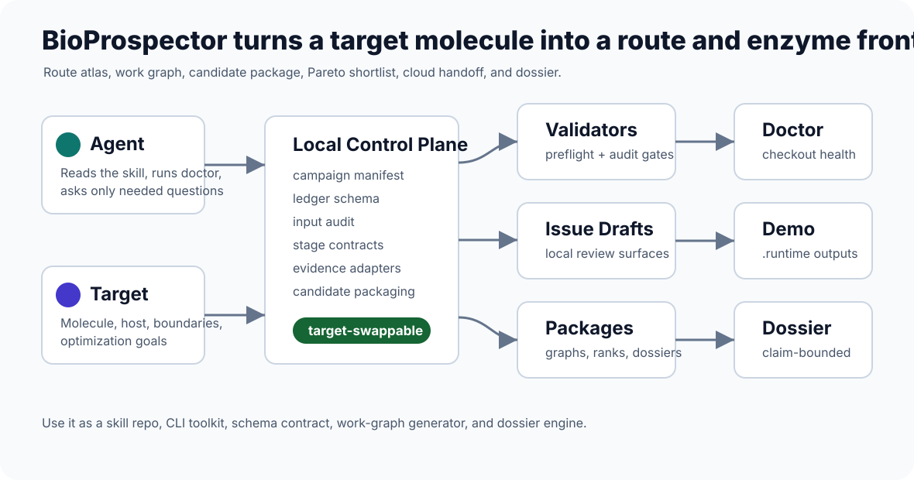
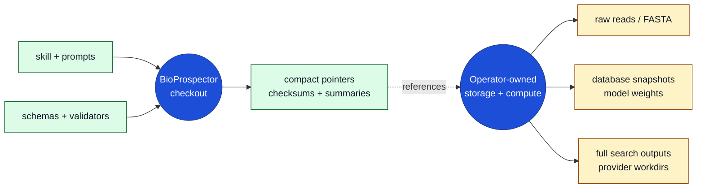
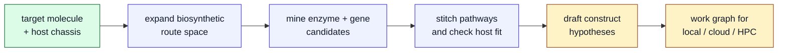
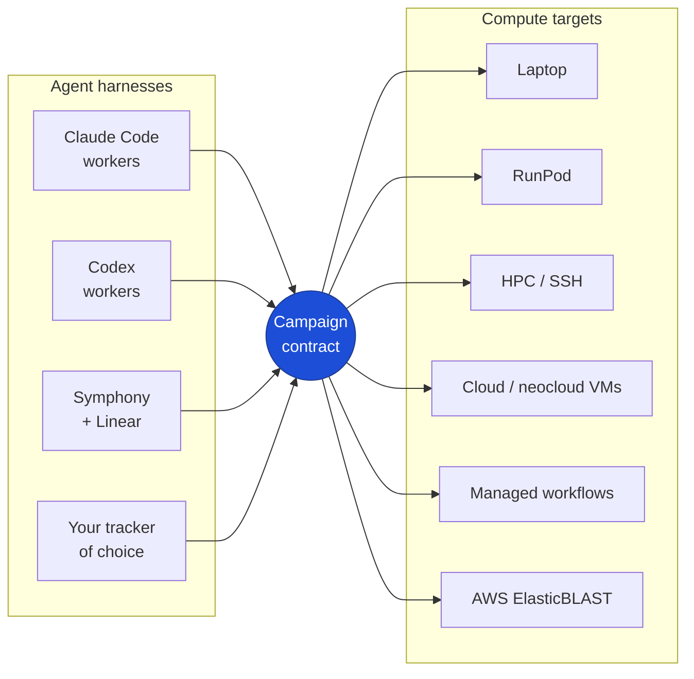

# BioSymphony BioProspector


BioProspector is an agentic harness for discovering biosynthetic pathways to
target molecules. Give your agent a target molecule and host chassis; the
skill helps it expand route space, mine enzyme and gene candidates, stitch
plausible pathways, and draft construct hypotheses your team can review.

The skill is designed to plug into the multi-agent harness your team already
uses. Symphony with Linear can run autonomous swarms. Claude Code workers
with Linear can run human-in-the-loop campaigns. Codex workers can drive any
tracker your team prefers. The same campaign contract drives every agent,
so harness choice stays a deployment decision.

It works across the compute you actually have. Everything can run from a
laptop, and the same campaign can escalate to RunPod, HPC, cloud VMs,
neocloud, managed workflows, or AWS ElasticBLAST when a search lane earns
that compute. RunPod is a blessed path, not the only path: BioProspector is
built for user-owned local, cloud, HPC, and managed resources.

> Give an agent a target molecule and a host. Get back a biosynthetic pathway
> campaign: enzyme-mining lanes, pathway stitching, construct hypotheses,
> compute-ready work graphs, and review packages your team can act on.

The repo carries the reusable campaign intelligence: schemas, validators,
prompts, examples, work graphs, and compact artifact contracts. It points at
operator-chosen workdirs, volumes, and buckets for heavy data. Your agent can
run real local or cloud work through those external paths while the checkout
keeps the compact pointers, checksums, summaries, rankings, and review
artifacts the team and the next agent need to keep moving.

Three public example campaigns ship ready to run:

- **vanillin in yeast**: starter scaffold for turning a target molecule and
  host into a first biosynthetic campaign.
- **nootkatone in yeast**: enzyme mining, pathway stitching, host-fit review,
  work graphs, and route-frontier planning.
- **Huperzine A**: dark-step reasoning, GeneCluster atlas planning, candidate
  packages, and construct-hypothesis handoffs.

All three are target-swappable for your own campaigns.



## Why This Is Powerful

A campaign run through this skill gives agents the operating structure that
most "agentic bioprospecting" demos skip:

- **Pathway discovery, not one-off answers.** BioProspector keeps natural,
  engineered, fed-substrate, analog, reverse-catabolism, dark-step, and
  de novo route families visible so the agent does not anchor on the first
  plausible path. See [`docs/capability-map.md`](docs/capability-map.md).
- **Enzyme and gene mining as a campaign.** Each pathway step can become a
  bounded search lane with candidate packages, source pointers, domain
  summaries, graph edges, rejected-candidate memory, and next-review tasks.
  See [`docs/enzyme-family-search.md`](docs/enzyme-family-search.md).
- **Construct-oriented pathway stitching.** The system keeps cofactors,
  stereochemistry, compartment, host fit, toxicity, transport, and missing
  steps attached to route decisions, so the output is a set of construct
  hypotheses and build-review lanes instead of a loose literature summary.
  See [`docs/host-structure-risk.md`](docs/host-structure-risk.md).
- **A compute-portable agent work graph.** The same campaign can start on a
  laptop and then escalate chosen lanes to RunPod, HPC, cloud VMs, neocloud,
  managed workflows, or AWS ElasticBLAST. See
  [`docs/compute-provider-strategy.md`](docs/compute-provider-strategy.md).
- **Guardrails that preserve credibility.** Planning, execution, evidence,
  and validation claims stay separated, so agents can be ambitious without
  pretending a pathway has been produced or validated before the evidence
  exists. See [`docs/no-false-success-gates.md`](docs/no-false-success-gates.md).

## How You Use This

BioProspector is a skill for your agent. You install it once into Claude
Code, Codex, Symphony workers, or another harness, then describe a campaign
in natural language: target molecule, host chassis, constraints, and the
compute you are willing to use. The agent operates the skill on your behalf:
it runs the underlying commands, expands the pathway campaign, drafts the work
graph, and returns construct-oriented review packages.

You stay in the role of the operator. The agent stays in the role of the
campaign worker. The CLIs that ship in this repo exist so the agent has a
stable, scriptable surface, and so you can run anything yourself when you
want to verify an install or inspect what the agent did. See
[`docs/AGENT_INSTALL.md`](docs/AGENT_INSTALL.md) for harness install paths
and [`docs/AGENT_PLAYBOOK.md`](docs/AGENT_PLAYBOOK.md) for copy-paste
mission prompts.

## What's In The Repo

```
skills/bioprospector/   the skill: SKILL.md, CLIs, example campaigns, references
docs/                   user and agent documentation (start with QUICKSTART.md)
templates/              Linear-style issue templates the agent draws from
demos/                  demo maps and sample outputs your agent will produce
schemas/                shared ledger and manifest contracts
src/                    installable bioprospector CLI
tests/                  validators and contract checks
```

The checkout holds the planning intelligence. Heavy data stays where you
already keep it.



## Core Workflow

The agent keeps each step reviewable while it expands from target molecule to
construct-oriented pathway hypotheses.



## What It Can Do

BioProspector gives agents a durable operating system for early bioprospecting:
expand broadly, preserve weird options, split work into lanes, compress noisy
evidence, and keep route-level decisions reviewable.

| Use case | What BioProspector gives you |
| --- | --- |
| Start from a molecule | Target contracts, manifests, required ledgers, preflight, and input audit. |
| Expand route space | Natural, engineered, fed-substrate, analog, reverse-catabolism, and missing-step route lanes. |
| Mine enzyme candidates | Candidate funnels, enzyme draft boards, sequence pointers, domain summaries, graph edges, and rejected-candidate memory. |
| Resolve dark steps | Unknown-gene hypotheses, multi-gene/module hypotheses, counterevidence rows, and cheapest-next-review planning. |
| Stitch pathways | Cofactor, stereochemistry, compartment, host-fit, toxicity, transport, and missing-step scorecards. |
| Compare route frontiers | Useful families across minimal-gene, strongest-evidence, host-fit, ambitious de novo, and diversity-library strategies. |
| Run agent work graphs | Linear-style Markdown issue drafts with dependencies, budgets, kill criteria, validation commands, and closeout blocks. |
| Prepare cloud-scale search | RunPod, HPC, cloud VM, neocloud, managed workflow, and ElasticBLAST readiness bundles with stage contracts and artifact joins. |
| Package review decisions | Candidate packages, campaign graphs, construct-hypothesis summaries, expected-output snapshots, and release checks. |

## Choose Your Workflow

| Workflow | Best when | Start with |
| --- | --- | --- |
| Local first hour | You want to see useful outputs immediately. | `make local-demo` |
| First campaign | You have a target molecule and host. | [`docs/FIRST_CAMPAIGN.md`](docs/FIRST_CAMPAIGN.md) |
| Agent work graph | A campaign needs bounded lanes instead of one long answer. | [`docs/WORKFLOWS.md`](docs/WORKFLOWS.md#3-agent-work-graph) |
| Linear/tracker mirror | A team wants dependencies, owners, blockers, and closeout comments in an external tracker. | [`docs/WORKFLOWS.md`](docs/WORKFLOWS.md#4-linear-or-tracker-mirror) |
| Cloud readiness | A future search may need RunPod, HPC, cloud VMs, or AWS ElasticBLAST. | [`docs/WORKFLOWS.md`](docs/WORKFLOWS.md#5-cloud-readiness) |
| Live execution closeout | A reviewed external run needs evidence joins and claim audit. | [`docs/WORKFLOWS.md`](docs/WORKFLOWS.md#6-operator-owned-live-cloud-run) |

See [`docs/WORKFLOWS.md`](docs/WORKFLOWS.md) for the full local-to-cloud
progression.

## What You Get In 5 Minutes

Running the local demo gives a newcomer the same artifacts the rest of the repo
builds on:

- campaign graph: the route, evidence, provider, and closeout lanes as a
  machine-readable work graph
- campaign status: a compact snapshot of route counts, search widths, open
  gates, maturity, and next commands
- handoff packet: status, graph, exact commands, reviewer notes, and safety
  boundaries in one folder
- agent brief: a ready-to-paste Codex/Claude/`/goal` prompt that explains how
  the repo complements a capable orchestrator, Symphony/Linear, and user-owned
  local or cloud resources
- GeneCluster atlas plan: metadata-only source-context planning for dark-step
  and cluster questions
- candidate package: accession/source pointers, domain summaries, graph edges,
  package provenance, and candidate intelligence ledgers
- Pareto ranking: route-level winners across evidence, host fit, minimal genes,
  ambitious routes, and diversity options
- Linear-style work graph: issue drafts with dependencies, budgets, kill
  criteria, validation commands, and closeout blocks
- review package: compact human-readable summary with hypotheses, blockers,
  rejected paths, and next lanes

## Talk To Your Agent

Once the skill is installed, you describe the campaign and the agent does the
rest. Useful starting prompts:

```text
Use the bioprospector skill in this checkout. Run doctor, keep everything local
for now, and create a first campaign for <target molecule> in <host>. Expand
biosynthetic route hypotheses, draft construct-oriented work lanes, and produce
a short review package under .runtime/.
```

```text
Use BioProspector to inspect the nootkatone example, generate local issue drafts
and a Pareto ranking under .runtime/, then summarize the best route families,
candidate bottlenecks, and highest-value next lanes.
```

```text
Use BioProspector to build a metadata-only GeneCluster atlas plan for the
Huperzine A public example. Validate the contract outputs and summarize which
source-context lanes change the route search.
```

```text
Use BioProspector to prepare a RunPod or HPC readiness packet for a future
enzyme-frontier search. Do not launch compute; return stage contracts, expected
outputs, blocker rows, and the compact ledgers that should come back after a
real run.
```

For a campaign-specific kickoff prompt, generate an agent brief:

```bash
python3 skills/bioprospector/scripts/bioprospector_agent_brief.py \
  --campaign skills/bioprospector/examples/huperzine-frontier-public-v0/campaign-manifest.json \
  --out .runtime/local-demo/huperzine/agent-brief \
  --prefix HUPERZINE \
  --profile public-demo \
  --mode goal \
  --agent codex
```

## Verify Your Install Yourself

You do not need to run any of this for the agent path. These commands let you
confirm the skill installed cleanly and see what the agent will produce.

```bash
make first-look
```

That target runs the doctor, the local demo, and points at the resulting
dossier. The equivalent step-by-step:

```bash
python3 skills/bioprospector/scripts/bioprospector_doctor.py --include-runtime
make local-demo
sed -n '1,80p' .runtime/local-demo/huperzine/dossier.md
```

`doctor` checks the checkout, schema, examples, release audit, tracked path
hygiene, and optional external bio tools. The local demo writes ignored
artifacts under `.runtime/`: a campaign graph, metadata-only GeneCluster atlas
plan, synthetic Atlas contract validation, candidate package ledgers, Pareto
rankings, and a compact dossier.

A sample of what the dossier looks like lives in
[`demos/expected-outputs/dossier-excerpt.md`](demos/expected-outputs/dossier-excerpt.md).
Other sample outputs (Pareto frontier row, work graph inventory, campaign
plan summary, provider readiness tree, closeout packet) live alongside it in
[`demos/expected-outputs/`](demos/expected-outputs).

To see the tool-use round trip without a real search, ingest one of the
synthetic samples in [`demos/sample-inputs/`](demos/sample-inputs):

```bash
python3 skills/bioprospector/scripts/bioprospector_evidence_ingest.py \
  --hits demos/sample-inputs/example.blast6.tsv \
  --out .runtime/sample-ingest/blast6 \
  --step-id S001 \
  --format blast6
```

That produces populated candidate funnels, draft board, sequence pointers,
graph edges, and evidence events under `.runtime/sample-ingest/blast6/`.
Four input formats ship: BLAST6, DIAMOND, MMseqs, and HMMER `--domtblout`.

Success looks like `BioProspector doctor: ok`, generated artifacts under
`.runtime/`, and a dossier that separates hypotheses, public evidence summaries,
claim blockers, and non-claims.

Expected demo outputs:

- `.runtime/local-demo/huperzine/campaign-plan.json`
- `.runtime/local-demo/huperzine/campaign-status.md`
- `.runtime/local-demo/huperzine/handoff/handoff.md`
- `.runtime/local-demo/huperzine/agent-brief/agent-brief.md`
- `.runtime/local-demo/huperzine/genecluster-atlas/genecluster-atlas-plan.json`
- `.runtime/local-demo/genecluster-synthetic/atlas/cluster_calls.tsv`
- `.runtime/local-demo/huperzine/candidate-package/`
- `.runtime/local-demo/nootkatone/ranking/pareto-frontier-ledger.tsv`
- `.runtime/local-demo/huperzine/dossier.md`

New users should start with [`docs/QUICKSTART.md`](docs/QUICKSTART.md) and
[`docs/WORKFLOWS.md`](docs/WORKFLOWS.md). The
local command map lives in [`docs/CLI_REFERENCE.md`](docs/CLI_REFERENCE.md), and
the repository boundary details live in
[`docs/PRIVACY_SECURITY_MODEL.md`](docs/PRIVACY_SECURITY_MODEL.md). For agent
skill installation, use [`docs/AGENT_INSTALL.md`](docs/AGENT_INSTALL.md); for a
custom first campaign, use [`docs/FIRST_CAMPAIGN.md`](docs/FIRST_CAMPAIGN.md).
Ready-to-use agent prompts live in [`docs/AGENT_PLAYBOOK.md`](docs/AGENT_PLAYBOOK.md),
concrete examples live in [`docs/USE_CASES.md`](docs/USE_CASES.md), and common
newcomer questions and terms live in [`docs/FAQ.md`](docs/FAQ.md) and
[`docs/GLOSSARY.md`](docs/GLOSSARY.md).

## Example Campaigns

| Example | What it demonstrates | Start here |
| --- | --- | --- |
| Vanillin in yeast | Starter scaffold, preflight, and first campaign shape. | [`skills/bioprospector/examples/vanillin-yeast-v0`](skills/bioprospector/examples/vanillin-yeast-v0) |
| Nootkatone in yeast | Route/enzyme frontier planning, issue lanes, and Pareto ranking. | [`skills/bioprospector/examples/nootkatone-yeast-v0`](skills/bioprospector/examples/nootkatone-yeast-v0) |
| Huperzine A frontier | Dark-step/source-context reasoning, GeneCluster atlas planning, candidate packages, and dossiers. | [`skills/bioprospector/examples/huperzine-frontier-public-v0`](skills/bioprospector/examples/huperzine-frontier-public-v0) |
| Synthetic GeneCluster fixture | Metadata-only cluster/function jury contracts without raw genome data. | [`skills/bioprospector/examples/genecluster-synthetic-v0`](skills/bioprospector/examples/genecluster-synthetic-v0) |

<details>
<summary><strong>High-ROI artifact catalog</strong></summary>

## High-ROI Artifacts

- `route-ledger.tsv`: route hypotheses and status
- `reaction-step-ledger.tsv`: normalized reaction steps
- `candidate-funnels.tsv`: raw hits through shortlist counts
- `enzyme-draft-board.tsv`: candidate enzyme scorecard
- `route-stitching-scorecard.tsv`: integrated route feasibility
- `claim-ledger.md`: claim levels, evidence, caveats
- `red-team-report.md`: rejected claims and weak links
- `pathway-inference-ledger.tsv`: ambiguity hypotheses and counterevidence
- `unknown-gene-hypothesis-ledger.tsv`: single-gene and multi-gene unknown-step hypotheses
- `enzyme-family-sweep.tsv`: family-level raw-hit compression before candidate promotion
- `genome-mining-plan.tsv` and `genome-hit-ledger.tsv`: compact genome-context evidence
- `structure-risk-ledger.tsv` and `host-comparison-ledger.tsv`: feasibility risks beyond sequence hits
- `assay-handoff-ledger.tsv` and `monitoring-ledger.tsv`: non-protocol validation priorities and campaign checkpoints
- `sequence-search-plan-ledger.tsv`: RunPod-local BLAST/DIAMOND/MMseqs/HMMER contracts with query ids, databases, budgets, thresholds, and output ledgers
- `candidate-sequence-ledger.tsv` and `domain-annotation-ledger.tsv`: AA-sequence pointers, checksums, domain spans, motifs, confidence, and license boundaries
- `candidate-intelligence-ledger.tsv`: publicly reported/reference enzymes and variants, signal peptides, PTMs, localization, expression watchouts, and close-canonical-match inferences
- `literature-search-ledger.tsv`: literature search terms, sources, recency windows, result caps, and compact citation output contracts
- `candidate-diversity-ledger.tsv`, `candidate-graph-ledger.tsv`, and `run-output-package-ledger.tsv`: conceptual enzyme graph, diversity spread, and high-detail package indexes
- `input-audit-ledger.tsv`: known inputs and explicit missing operator items before worker questions
- `operator-intake-ledger.tsv`: short interview confirmations, assumptions, skip policy, and later blockers
- `run-maturity-ledger.tsv`: L0 plan through L5 claim-audited review ladder
- `stage-contract-ledger.tsv` and `stage-progress-ledger.tsv`: long-run stage contracts, heartbeats, done markers, fallbacks, and resume paths
- `campaign-status.json` or `campaign-status.md`: compact campaign orientation snapshot for agents and operators
- `handoff.md` and `handoff-manifest.json`: review-only worker/reviewer packet over status, graph, commands, and safety boundaries
- `agent-brief.md`, `agent-goal-prompt.txt`, and `agent-brief.json`: ready-to-paste agent kickoff material for Codex, Claude Code, Symphony/Linear, or `/goal`-style workflows
- `lane-status-ledger.tsv`, `fanout-estimate-ledger.tsv`, `partial-summary-ledger.tsv`, and `stale-output-guard-ledger.tsv`: scale control, partial closeout, and stale-output protection
- `self-learning-skill-ledger.tsv`: hiccup observations, hypotheses, probes, stop-losses, and durable runbook/skill/template/validator decisions
- `organism-sample-ledger.tsv`, `query-set-ledger.tsv`, and `target-dataset-ledger.tsv`: target/source/query provenance
- `target-evidence-ledger.tsv` and `decoy-control-ledger.tsv`: target-evidence joins and negative-control gates
- `execution-artifact-ledger.tsv`: artifact proof with `dry_run` and `mock_tools` separated from real execution
- `retrospective-ledger.tsv`: redacted after-run audit rows for provider outcomes, artifact presence, cleanup, and timing
- `tool-registry-ledger.tsv`, `adapter-contract-ledger.tsv`, `evidence-event-ledger.tsv`, and `tool-execution-proof-ledger.tsv`: compact adapter contracts, normalized evidence events, and proof rows that cannot bypass execution gates
- `compute-provider-ledger.tsv`: local, RunPod, cloud, neocloud, HPC, and ElasticBLAST provider contracts
- `provider-launch-preflight-ledger.tsv`: image pull, registry auth, branch/snapshot, payload, volume, budget, secrets, and stage launch blockers
- `supply-chain-preflight-ledger.tsv`: image/tool SBOM, vulnerability, signature, provenance, checksum, and policy blockers
- `workflow-framework-ledger.tsv`: shell, Python, Nextflow, Snakemake, CWL/WDL, and managed workflow compatibility
- `route-rule-ledger.tsv`, `thermodynamics-ledger.tsv`, `metabolic-model-ledger.tsv`, `strain-design-ledger.tsv`, and `chemoenzymatic-fallback-ledger.tsv`: route expansion, feasibility, host context, non-operational host-fit hypotheses, and fallback ideas
- `bgc-context-ledger.tsv`, `metagenome-context-ledger.tsv`, `mag-quality-ledger.tsv`, `metabolomics-evidence-ledger.tsv`, `compound-source-ledger.tsv`, and `eukaryotic-annotation-ledger.tsv`: source, cluster, metagenome, spectra, compound, and annotation context
- `candidate-ranking-ledger.tsv` and `pareto-frontier-ledger.tsv`: per-step candidate ranks and route-level Pareto views across minimal genes, strongest evidence, clearest validation handoff, host fit, ambitious routes, and diversity-library options
- `genecluster-source-scout-ledger.tsv`, `genecluster-route-decision-ledger.tsv`, `genecluster-atlas-contract-ledger.tsv`, `cluster_calls.tsv`, `bgc_consensus.tsv`, `protein_function_votes.tsv`, and `protein_function_jury.tsv`: metadata-only source scouting, route ceilings, and cluster/function jury contracts for public genome-context atlas lanes
- `schemas/bioprospector-ledgers.json`: shared manifest, ledger header, and enum contract for validators and generators

</details>

## Multi-Harness Portability

The same campaign contract drives every agent, every provider, and every
environment. The repo carries the planning intelligence: schemas, validators,
docs, examples, work graphs, ledgers, and review packages. It points at operator-
chosen workdirs, volumes, and buckets for the heavy data and execution. A
campaign stays small enough to fork, audit, hand off, and re-run, and your
agents can move between local compute, RunPod, HPC, cloud VMs, neocloud,
managed workflows, and AWS ElasticBLAST with the same campaign contracts.
See [`docs/PRIVACY_SECURITY_MODEL.md`](docs/PRIVACY_SECURITY_MODEL.md) for the
data-class and credential policy.



## What The Agent Runs For You

These are the commands the agent invokes under the hood. You can run them
yourself to verify behavior, inspect outputs, or extend the skill. The full
command surface lives in [`docs/CLI_REFERENCE.md`](docs/CLI_REFERENCE.md);
the recipes below cover the common path from scaffold to review package.

Optional editable install:

```bash
python3 -m pip install -e .
bioprospector --help
bioprospector commands --json
```

The package is intentionally source-checkout oriented. Console scripts run
from the editable checkout that owns the CLI, or from an explicit
`BIOPROSPECTOR_REPO_ROOT`. They do not run repo-shaped code from the caller
working directory.

Choose a workflow with [`docs/WORKFLOWS.md`](docs/WORKFLOWS.md), then choose
a local mode with [`docs/MODES.md`](docs/MODES.md).

Create a campaign scaffold from a target contract:

```bash
python3 skills/bioprospector/scripts/bioprospector_new_campaign.py \
  --target-contract templates/target-contract.example.json \
  --out .runtime/scaffolds/example-target-v0 \
  --campaign-id example-target-v0
```

Validate a campaign manifest, ledger keys, and joins:

```bash
python3 skills/bioprospector/scripts/bioprospector_preflight.py \
  --campaign skills/bioprospector/examples/vanillin-yeast-v0/campaign-manifest.json
```

Generate sidecar-ready Linear-style issue drafts (without calling a tracker
API):

```bash
python3 skills/bioprospector/scripts/bioprospector_issue_dry_run.py \
  --campaign skills/bioprospector/examples/nootkatone-yeast-v0/campaign-manifest.json \
  --prefix NOOTKATONE \
  --out .runtime/nootkatone-linear-issues \
  --include-profile full-frontier
```

Convert compact tool output into evidence ledgers:

```bash
python3 skills/bioprospector/scripts/bioprospector_evidence_ingest.py \
  --hits demos/sample-inputs/example.blast6.tsv \
  --out .runtime/evidence-ingest/example \
  --step-id S001 \
  --format blast6
```

The ingest also accepts DIAMOND, MMseqs (twelve-column TSV), and HMMER
`--domtblout` summaries. See
[`demos/sample-inputs/`](demos/sample-inputs/) for runnable samples.

Generate review-only provider readiness bundles. These produce launch
packets for operator review; they do not create pods, submit jobs, or touch
AWS:

```bash
python3 skills/bioprospector/scripts/bioprospector_runpod_bundle.py \
  --campaign skills/bioprospector/examples/vanillin-yeast-v0/campaign-manifest.json \
  --out .runtime/runpod-readiness/vanillin-yeast-v0

python3 skills/bioprospector/scripts/bioprospector_elasticblast_bundle.py \
  --campaign skills/bioprospector/examples/nootkatone-yeast-v0/campaign-manifest.json \
  --out .runtime/elasticblast-readiness/nootkatone-yeast-v0 \
  --bucket-uri s3://REPLACE_ME_OPERATOR_APPROVED_BUCKET/biosymphony-elasticblast \
  --database nr \
  --budget-usd 25
```

Run the joined contract self-check. The default is planning-friendly; live
closeout adds the required evidence flags:

```bash
python3 skills/bioprospector/scripts/bioprospector_contract_self_check.py \
  --campaign skills/bioprospector/examples/nootkatone-yeast-v0/campaign-manifest.json

python3 skills/bioprospector/scripts/bioprospector_contract_self_check.py \
  --campaign path/to/live/campaign-manifest.json \
  --require-real-execution \
  --require-target-evidence \
  --require-decoy-controls \
  --require-maturity L5
```

Export a compact planning dossier:

```bash
python3 skills/bioprospector/scripts/bioprospector_dossier_export.py \
  --campaign skills/bioprospector/examples/huperzine-frontier-public-v0/campaign-manifest.json \
  --out .runtime/dossiers/huperzine-frontier-public-v0.md
```

Run the public release gate:

```bash
python3 skills/bioprospector/scripts/bioprospector_doctor.py --include-runtime
make release-check
```

For the deeper contracts behind each lane, read:

- [`docs/symphony-linear-sidecar.md`](docs/symphony-linear-sidecar.md): portable Symphony sidecar.
- [`docs/operator-intake.md`](docs/operator-intake.md): operator intake pattern and `skip and go` boundary.
- [`docs/stage-progress-and-provider-preflight.md`](docs/stage-progress-and-provider-preflight.md): stage and provider launch preflight.
- [`docs/self-learning-skill-runbook.md`](docs/self-learning-skill-runbook.md): turn process hiccups into durable improvements.
- [`docs/runpod-blast-candidate-package.md`](docs/runpod-blast-candidate-package.md): RunPod BLAST and candidate-package contract.
- [`docs/PUBLIC_SWITCH_CHECKLIST.md`](docs/PUBLIC_SWITCH_CHECKLIST.md): pre-publish checklist.
- [`docs/CLI_REFERENCE.md`](docs/CLI_REFERENCE.md): full local command surface.

## Current Scope

The skill ships with:

- schemas, issue templates, campaign specs, and validators
- local checkout doctor and public-release audit gates
- campaign scaffold generation, dossier export, and compact evidence
  ingestion from tabular hit summaries
- campaign graph compilation, candidate package indexing, route and Pareto
  ranking, and sidecar-aware dossier export
- public demo sidecar smoke tests for issue drafts and readiness bundles
- RunPod and container planning, AWS ElasticBLAST wide-search planning
- ambiguity and unknown-gene planning
- genome-context, structure-risk, host-fit, assay-handoff, and monitoring
  ledgers
- input-audit, maturity, target-evidence, decoy-control, and
  execution-artifact gates
- operator intake confirmations with a `skip and go` planning path
- stage contracts, progress ledgers, provider launch preflight, and
  no-silent-fallback gates
- self-learning skill rows for hiccups that should become durable runbook,
  skill, template, validator, or issue-lane improvements
- provider and workflow-framework contracts
- RunPod BLAST and search contracts, plus candidate package ledgers for
  graph, AA sequence pointers, domain maps, candidate intelligence,
  literature-summary contracts, and diversity spread
- adapter registry and contracts, normalized evidence events, schema-checked
  tool proof rows, and strict gates for provider package joins
- default candidate-intelligence planning, with operator-approved public
  lookup or predictor lanes once provider, tool, API, data-policy, and
  output-boundary preflight passes
- opportunity lanes for schema hardening, executable proof, supply chain,
  active-site audit, route rules, thermodynamics, metabolic modeling,
  non-protocol strain hypotheses, fallback, BGC/metagenome/metabolomics
  context, compound/source priors, and review surfaces
- small example ledgers

Provider lanes are operator-chosen escalations. RunPod, HPC, cloud VMs,
neocloud, managed workflows, and AWS ElasticBLAST each have a reviewed
readiness bundle that preserves the campaign ledgers and self-check
contracts. Readiness commands produce launch packets for operator review;
they do not create cloud resources, seed Linear, start Symphony, or download
databases on their own.

## Public Capability Map

Start with [`docs/PUBLIC_LAUNCH_PAD.md`](docs/PUBLIC_LAUNCH_PAD.md) for the
full capability map, release boundary, and workflow reference. The canonical
agent skill remains [`skills/bioprospector/SKILL.md`](skills/bioprospector/SKILL.md).
