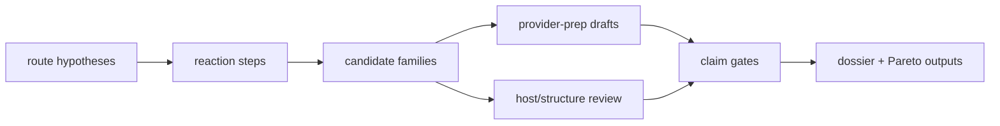

# Public Nootkatone demo walkthrough

## What this demo shows

- Target contracts can expand into route, step, evidence, ambiguity, host-fit,
  structure-risk, genome-context, RunPod prep, and ElasticBLAST prep issues.
- The campaign can carry unknown-step and unknown-gene hypotheses without
  overclaiming production or pathway completion.
- Wide searches are gated through prep issues, budget limits, compact output
  contracts, and explicit stop points.
- Public examples can pass contract checks without raw sequences, database mirrors, model
  weights, AWS credentials, or large local artifacts.

## Claim ceiling

The demo establishes planning maturity for routes, candidate families,
evidence gates, and Pareto ranking. Production claims, enzyme catalysis
claims, live tool runs (BLAST, MMseqs2, HMMER, Foldseek, RunPod, AWS,
Symphony), and wet-lab protocols require operator evidence joined through
the live closeout path and institutional review. See
[`BIOSAFETY.md`](../BIOSAFETY.md) and [`NON_CLAIMS.md`](../NON_CLAIMS.md).

## Walkthrough



1. Inspect `skills/bioprospector/examples/nootkatone-yeast-v0/campaign-manifest.json`.
2. Run campaign preflight with local artifact scanning.
3. Generate dry-run issue drafts with all prep-only lane flags.
4. Review the generated issue graph for route, step, ambiguity, family sweep,
   genome-context, structure-risk, host comparison, assay handoff, monitoring,
   RunPod prep, and ElasticBLAST prep.
5. Verify every issue keeps the public demo claim boundary.

```bash
python3 skills/bioprospector/scripts/bioprospector_preflight.py \
  --campaign skills/bioprospector/examples/nootkatone-yeast-v0/campaign-manifest.json \
  --repo-root . \
  --scan-local-artifacts

python3 skills/bioprospector/scripts/bioprospector_issue_dry_run.py \
  --campaign skills/bioprospector/examples/nootkatone-yeast-v0/campaign-manifest.json \
  --prefix NOOTKATONE \
  --out .runtime/nootkatone-linear-issues \
  --include-profile full-frontier

python3 skills/bioprospector/scripts/bioprospector_pareto_rank.py \
  --campaign skills/bioprospector/examples/nootkatone-yeast-v0/campaign-manifest.json \
  --out .runtime/rankings/nootkatone-yeast-v0

python3 skills/bioprospector/scripts/bioprospector_runpod_bundle.py \
  --campaign skills/bioprospector/examples/nootkatone-yeast-v0/campaign-manifest.json \
  --out .runtime/runpod-readiness/nootkatone-yeast-v0

python3 skills/bioprospector/scripts/bioprospector_elasticblast_bundle.py \
  --campaign skills/bioprospector/examples/nootkatone-yeast-v0/campaign-manifest.json \
  --out .runtime/elasticblast-readiness/nootkatone-yeast-v0 \
  --bucket-uri s3://REPLACE_ME_OPERATOR_APPROVED_BUCKET/biosymphony-elasticblast \
  --database nr \
  --budget-usd 25
```

## Expected outputs

- Contract-checked planning ledgers.
- Deterministic dry-run issue markdown under ignored `.runtime/`.
- Pareto frontier rows under `.runtime/rankings/nootkatone-yeast-v0/`.
- RunPod readiness bundle under `.runtime/runpod-readiness/nootkatone-yeast-v0/`.
- AWS ElasticBLAST readiness bundle under `.runtime/elasticblast-readiness/nootkatone-yeast-v0/`.
- All artifacts land under ignored `.runtime/`, with live providers,
  trackers, and databases reserved for operator-approved execution.
