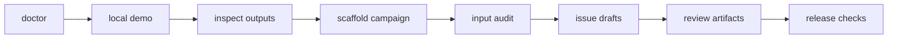

# Quickstart

BioProspector is a skill for your agent. Install it in your agent harness, then
describe a target molecule, host chassis, constraints, and available compute.
The agent runs the commands and returns review artifacts for a biosynthetic
pathway campaign. This quickstart covers the agent path and the self-run path
that verifies the installation and exposes the generated artifacts.

These commands generate local artifacts under gitignored `.runtime/`. A live
run can use an operator-approved external working directory, volume, or bucket.
Return only compact summaries, route decisions, checksums, and opaque pointers.

If the terminology is new, read [`FAQ.md`](FAQ.md) and
[`GLOSSARY.md`](GLOSSARY.md) first. For tracker, cloud-readiness, or live-run
handoff paths after the quickstart, use [`WORKFLOWS.md`](WORKFLOWS.md).

## Agent path

1. Install BioProspector as a skill in your agent harness. See
   [`AGENT_INSTALL.md`](AGENT_INSTALL.md) for Claude Code, Codex, and
   Symphony-compatible workers.
2. Paste a starter prompt from [`AGENT_PLAYBOOK.md`](AGENT_PLAYBOOK.md) or
   write your own. A simple one:

   ```text
   Use the bioprospector skill in this checkout. Run doctor, then create a
   first campaign for <target molecule> in <host>. Expand route hypotheses,
   draft non-procedural candidate hypotheses, and produce a short review package
   under .runtime/.
   ```
3. Review what the agent returns. The compact, human-readable artifacts to
   read first are the campaign status, the handoff packet, and the review
   package.

## Self-run path

You do not need this path for the agent flow. It is useful when you want to
verify the installation, inspect the generated artifacts, or extend
the skill.

Prerequisites:

- Python 3.11 or newer.
- `make` and a POSIX shell for the bundled local command targets.
- `git` for tracked-file hygiene checks.
- Run commands from the repository root unless a command says otherwise.
- Optional: `gitleaks` for local secret and history scanning before a public
  release.



## 1. Check the checkout

```bash
python3 skills/bioprospector/scripts/bioprospector_doctor.py --include-runtime
```

The doctor verifies the local schema, core scripts, public examples, public
audit, and forbidden tracked directories. Optional bioinformatics/cloud tools
are reported as optional only.

## 2. Run the local demo

```bash
make local-demo
```

This builds a campaign graph, metadata-only GeneCluster atlas plan, synthetic
Atlas contract outputs, candidate package indexes, route-frontier rankings,
and compact review packages.

Useful outputs:

- `.runtime/local-demo/huperzine/campaign-plan.json`
- `.runtime/local-demo/huperzine/genecluster-atlas/genecluster-atlas-plan.json`
- `.runtime/local-demo/genecluster-synthetic/atlas/`
- `.runtime/local-demo/huperzine/candidate-package/`
- `.runtime/local-demo/nootkatone/ranking/pareto-frontier-ledger.tsv`
- `.runtime/public-demo-smoke/nootkatone/issues/`

## 3. Generate a campaign scaffold

```bash
python3 skills/bioprospector/scripts/bioprospector_new_campaign.py \
  --target-contract templates/target-contract.example.json \
  --out .runtime/scaffolds/example-target-v0 \
  --campaign-id example-target-v0
```

The scaffold is compact and reviewable. Promote only reviewed compact
summaries into tracked examples.

## 4. Validate before asking questions

```bash
python3 skills/bioprospector/scripts/bioprospector_preflight.py \
  --campaign .runtime/scaffolds/example-target-v0/campaign-manifest.json \
  --repo-root . \
  --scan-local-artifacts

python3 skills/bioprospector/scripts/bioprospector_input_audit.py \
  --campaign .runtime/scaffolds/example-target-v0/campaign-manifest.json
```

Ask operators only for true missing decisions. If planning proceeds on
assumptions, record the assumption and keep execution/claim closeout blocked
until it is confirmed.

## 5. Validate stage contracts

```bash
python3 skills/bioprospector/scripts/bioprospector_stage_contract.py \
  --campaign skills/bioprospector/examples/nootkatone-yeast-v0/campaign-manifest.json
```

Use `--require-terminal --require-real-execution` only for a real closeout gate;
the public examples intentionally remain review-only.

## 6. Draft work lanes

```bash
python3 skills/bioprospector/scripts/bioprospector_issue_dry_run.py \
  --campaign skills/bioprospector/examples/nootkatone-yeast-v0/campaign-manifest.json \
  --prefix NOOTKATONE \
  --out .runtime/nootkatone-linear-issues \
  --include-profile full-frontier
```

`full-frontier` drafts evidence, provider-preflight, sequence-search,
candidate-package, GeneCluster, scale-control, self-learning, and opportunity
lanes. It creates Markdown issue bodies only.

## 7. Build review artifacts

```bash
python3 skills/bioprospector/scripts/bioprospector_campaign_graph.py \
  --campaign skills/bioprospector/examples/huperzine-frontier-public-v0/campaign-manifest.json \
  --out .runtime/campaign-graphs/huperzine-frontier-public-v0.json

python3 skills/bioprospector/scripts/bioprospector_candidate_package.py \
  --campaign skills/bioprospector/examples/huperzine-frontier-public-v0/campaign-manifest.json \
  --out .runtime/candidate-packages/huperzine-frontier-public-v0

python3 skills/bioprospector/scripts/bioprospector_dossier_export.py \
  --campaign skills/bioprospector/examples/huperzine-frontier-public-v0/campaign-manifest.json \
  --sidecar-dir .runtime/candidate-packages/huperzine-frontier-public-v0 \
  --out .runtime/dossiers/huperzine-frontier-public-v0.md
```

Review artifacts are indexes and summaries. They are not raw sequence archives,
wet-lab plans, production claims, or biological validation.

## 8. Run release checks

```bash
make release-check
```

This runs syntax checks, unit tests, package smoke checks, doctor checks, docs
link checks, example preflights, local demo generation, root audit, and runtime
audit.

Before publishing a release, also run:

```bash
gitleaks dir . --no-banner --redact --verbose
gitleaks detect --source . --no-banner --redact --verbose
```

See the [`public release checklist`](PUBLIC_SWITCH_CHECKLIST.md) and
[`privacy and security model`](PRIVACY_SECURITY_MODEL.md) for the publication
boundary.
