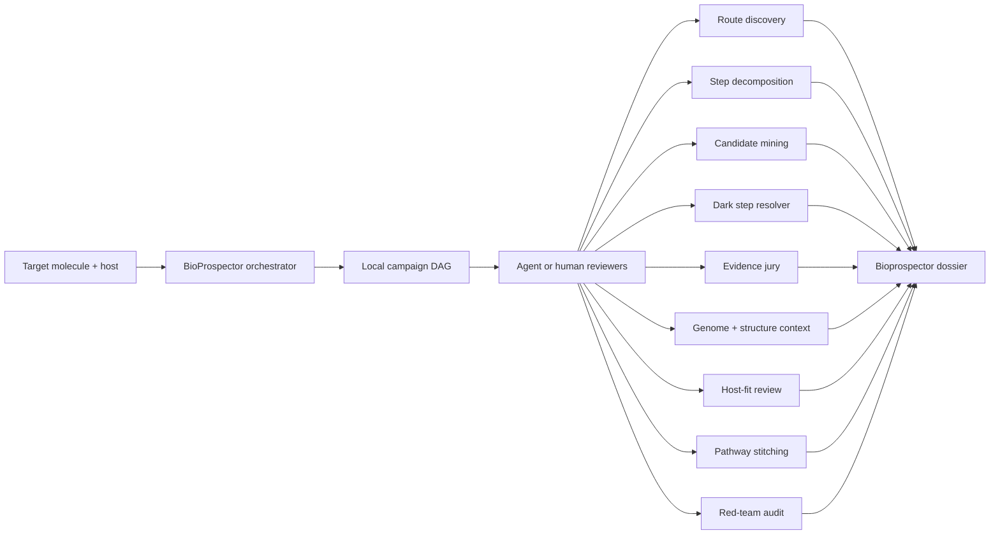

# Architecture

## Core Thesis

Bioprospecting and pathway stitching are not one search. They are an expanding and compressing graph:

1. Define target molecule, host, and constraints.
2. Enumerate known, plausible, analog, degradation-derived, and speculative routes.
3. Normalize each route into reaction steps.
4. Mine candidate enzymes per step across databases, genomes, literature, and homolog families.
5. Resolve ambiguous steps through chemistry-first hypotheses, counterevidence, and multi-gene module review.
6. Score candidates with sequence, domain, motif, substrate, structure, kinetics, genome context, and host-fit evidence.
7. Assemble candidate routes while preserving unresolved gaps.
8. Minimize and rank route designs.
9. Red-team the claims and output a validation roadmap.

## System Diagram

## Local DAG First

The tracked ledgers and generated Markdown issue drafts form the default
research graph. Linear can mirror this graph later, but it is optional.

The graph should store:

- campaign contract
- route branches
- reaction step issues
- evidence-lane issues
- ambiguity and dark-step issues
- enzyme-family sweep issues
- genome-context, structure-risk, host-comparison, assay-handoff, and monitoring issues
- candidate funnel budgets
- dependencies and review gates
- agent or reviewer outcomes
- red-team decisions

## Optional Agent Crew

Agent, Symphony, or human-review roles:

- route cartographer
- unknown-step hunter
- dark-step resolver
- reverse catabolism scout
- natural-product genome miner
- enzyme-family taxonomist
- candidate harvester
- structure and specificity jury
- chassis engineer
- pathway stitcher
- minimizer
- red-team reviewer
- dossier builder

## Heavy Execution Boundary

The repo is the control plane. Heavy work belongs in configured local workdirs, RunPod network volumes, HPC scratch, or managed workflow storage.

Provider roles:

- RunPod manual Pod: recommended optional provider path for controlled public/open data search, candidate compression, scoring, and route assembly.
- AWS ElasticBLAST: reviewed optional wide-search escalation against official NCBI BLAST databases.
- Local, cloud VM, neocloud VM, SSH/HPC, and managed workflow services: compatible provider-neutral lanes only when they preserve the same ledgers, artifact handoff, stage progress, and self-check gates.

Framework roles:

- shell/Python: readiness, smoke checks, validators, and ledger joins
- Nextflow/Snakemake: preferred future live-run frameworks for resumable provider execution
- CWL/WDL/managed workflows: compatible only through wrappers that emit BioProspector ledgers and provenance

Local repo may store:

- manifests
- small ledgers
- derived summaries
- issue bodies
- validation output
- citations and resource ledgers

Local repo must not store:

- raw reads
- private sequences
- genome mirrors
- BLAST databases
- model weights
- heavy intermediate search outputs
