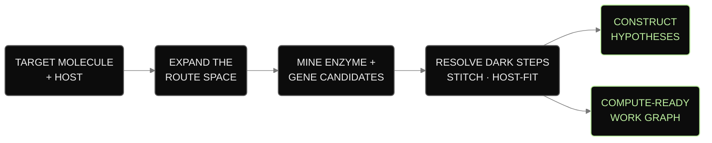
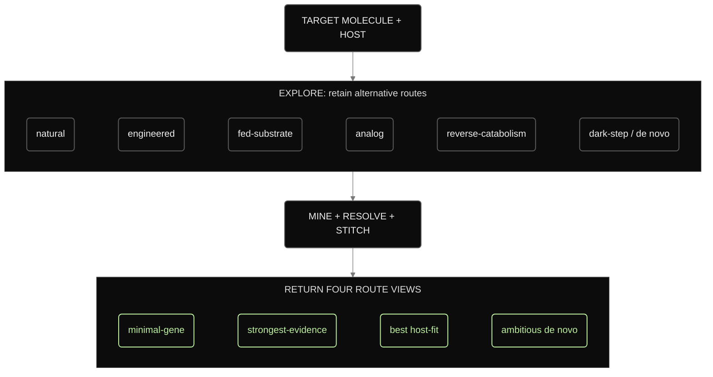
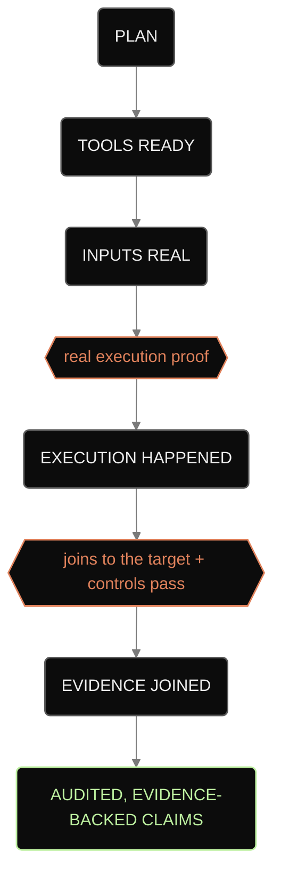
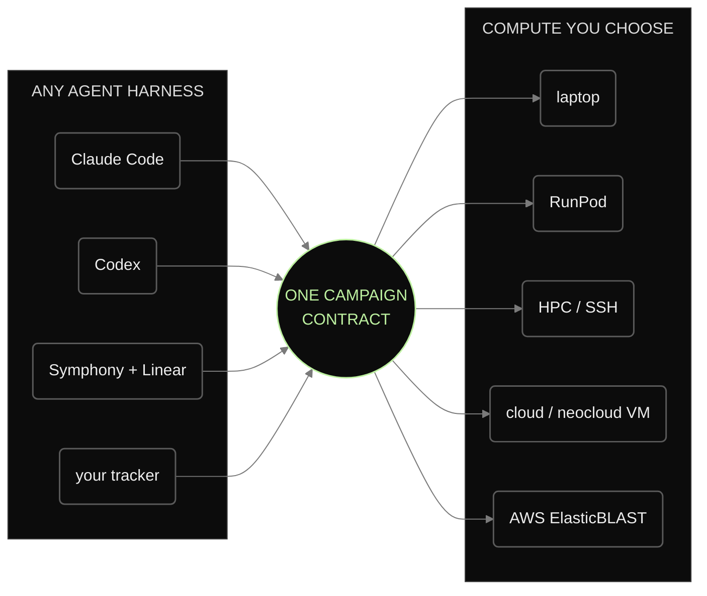
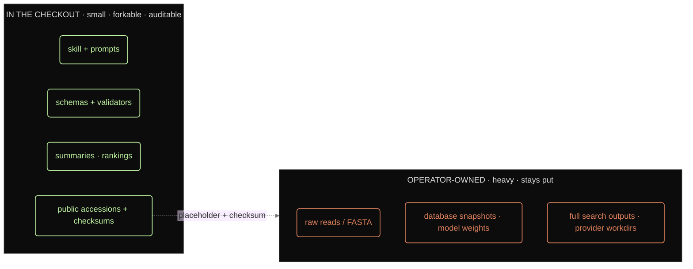

# BioSymphony BioProspector


**A portable agent skill for turning a target molecule and host into route
options, enzyme and gene search plans, and evidence-bounded review packages.**

BioProspector gives research agents a shared campaign contract for
biosynthetic-pathway planning and evidence review. Provide a target molecule,
host, constraints, and compute boundary. The skill organizes route exploration,
candidate mining, dark-step resolution, and route review into compact ledgers
and reviewable handoffs.

Start locally. When a lane needs more compute, the same contract can prepare
operator-reviewed work for RunPod, HPC, a cloud VM, or AWS ElasticBLAST. It
works with Claude Code, Codex, Symphony with Linear, and tracker-neutral queues.

The repository includes planning examples for **vanillin**, **nootkatone**, and
**Huperzine A**, each designed to be adapted to another target.



## What agents get

A campaign gives an agent concrete work products:

- **A broader route space:** compare natural, engineered, fed-substrate,
  analog, reverse-catabolism, dark-step, and de novo route families early.
- **Explicit unknowns:** turn missing chemistry, unknown genes, and hidden
  multi-gene steps into testable hypotheses with counterevidence.
- **Traceable candidates:** shortlist genes for each reaction, preserve source
  pointers, summarize domains, and record rejected candidates.
- **Four route views:** return minimal-gene, strongest-evidence,
  best-host-fit, and ambitious options with their trade-offs.
- **Clear evidence boundaries:** keep plans, execution records, search results,
  controls, and claims separate so reviewers can see what remains unproven.





The public examples are planning fixtures. They do not show that a search ran
or that a route, host, construct, or assay was validated.

## Where it runs

Start on a laptop. Move only the lanes that need more compute, after an operator
approves the budget, data policy, and credentials outside this repository. The
campaign contract stays the same when the agent harness or compute provider
changes.



## What stays in the checkout

The checkout contains the skill, prompts, schemas, validators, and compact
campaign summaries. Raw reads, database snapshots, model weights, full search
output, and exact external locations stay in ignored operator state. The
checkout keeps public accessions, placeholders, checksums, and reviewed summaries.



```text
skills/bioprospector/   the skill: SKILL.md, CLIs, example campaigns, references
docs/                   user and agent documentation (start with QUICKSTART.md)
templates/              issue templates the agent draws from
demos/                  demo maps and sample outputs
schemas/                shared campaign + ledger contracts
src/                    installable bioprospector CLI
tests/                  validators and contract checks
```

## Verify the checkout

To verify the checkout and generate the local demo:

```bash
python3 scripts/bioprospector_doctor.py --include-runtime
make local-demo
```

The demo builds Huperzine A planning artifacts: route options, candidate
pointers, a ranked route set, a metadata-only gene-cluster plan, and a compact
review package. Every claim remains labeled by its evidence level.

New here? Start with [`docs/QUICKSTART.md`](docs/QUICKSTART.md) and [`docs/WORKFLOWS.md`](docs/WORKFLOWS.md). To run a campaign for your own molecule, see [`docs/FIRST_CAMPAIGN.md`](docs/FIRST_CAMPAIGN.md). Copy-paste agent prompts live in [`docs/AGENT_PLAYBOOK.md`](docs/AGENT_PLAYBOOK.md).

## Talk to your agent

Once the skill is installed, give the agent a target, host, and boundary:

```text
Use the bioprospector skill in this checkout. Run doctor, keep everything local,
and start a campaign for <target molecule> in <host>. Explore the route space,
draft non-procedural construct-hypothesis lanes, and return a short review
package under .runtime/. Keep raw or private data, credentials, provider IDs,
and private paths outside the repository.
```

```text
Use BioProspector to resolve the dark steps in the Huperzine A example: turn the
unknown chemistry into single-gene and multi-gene hypotheses with counterevidence,
then identify the lowest-cost non-procedural evidence check that would distinguish them.
```

## Result boundaries

BioProspector returns plans, search contracts, rankings, and review packages.
Production, host performance, assay results, and deployment readiness require
separate execution records, controls, and expert review. See
[`NON_CLAIMS.md`](NON_CLAIMS.md) and
[`docs/no-false-success-gates.md`](docs/no-false-success-gates.md).

## Reference documentation

Use [`docs/PUBLIC_LAUNCH_PAD.md`](docs/PUBLIC_LAUNCH_PAD.md) for the full
capability map, [`skills/bioprospector/SKILL.md`](../SKILL.md) for the canonical
agent instructions, and [`docs/CLI_REFERENCE.md`](docs/CLI_REFERENCE.md) for
commands. The data boundary is defined in
[`docs/PRIVACY_SECURITY_MODEL.md`](docs/PRIVACY_SECURITY_MODEL.md).

<details>
<summary><strong>Artifact contract</strong></summary>

A campaign uses versioned ledgers and review artifacts for routes, reaction
steps, candidates, evidence, controls, provider readiness, and claims. The
shared contract and full artifact list are in
[`docs/capability-map.md`](docs/capability-map.md) and
[`schemas/bioprospector-ledgers.json`](schemas/bioprospector-ledgers.json).

</details>
