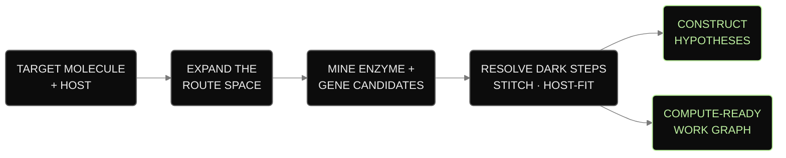
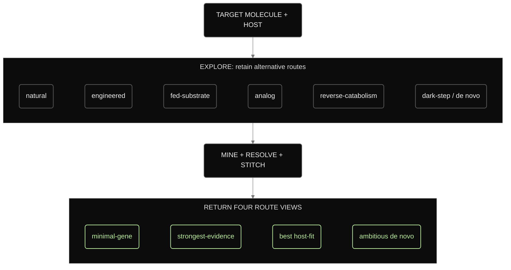
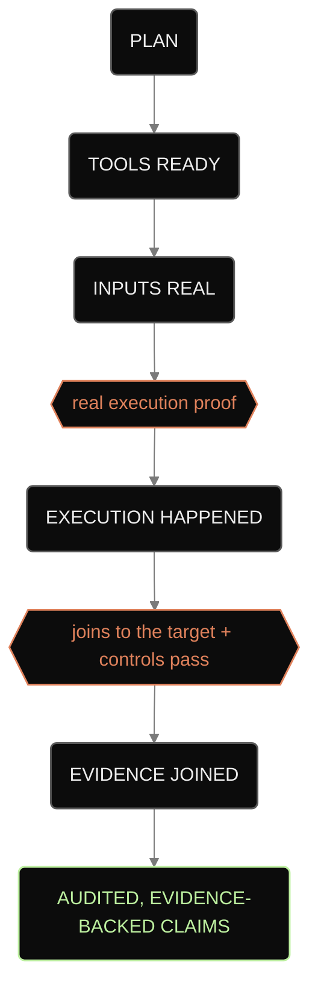
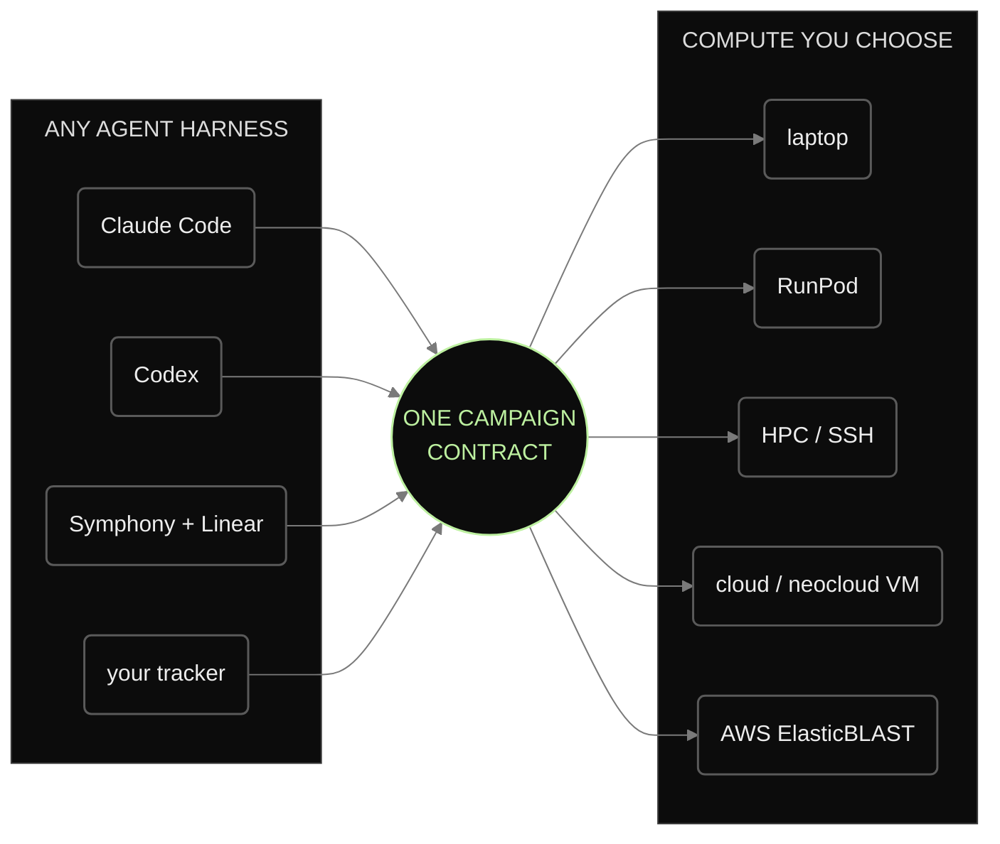
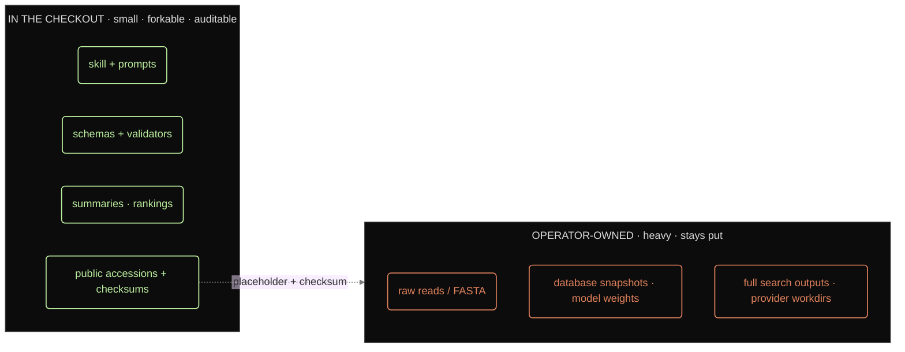

# BioSymphony BioProspector

BioProspector is an agent skill for planning biosynthetic pathways and
reviewing the evidence for candidate enzymes and genes. Give your agent a
target molecule, host, constraints, and compute budget. The skill defines how
to record route options, candidate rankings, source evidence, and unresolved
questions in a review package.

Use it with Codex, Claude Code, or Symphony with Linear. The repository includes
the skill, command-line tools, schemas, validators, and compact planning
examples for vanillin, nootkatone, and Huperzine A. The examples demonstrate
planning outputs; they do not establish biological validation.


## Start here

To use BioProspector with your agent, follow the
[skill installation guide](docs/AGENT_INSTALL.md), then the
[first campaign guide](docs/FIRST_CAMPAIGN.md).

To inspect the local demo, run this command from the repository root with
Python 3.11+, Git, and Make available:

```bash
make first-look
```

The command checks the checkout and generates local planning artifacts without
launching cloud jobs. Open `.runtime/local-demo/huperzine/dossier.md` to review
the output. See the [quickstart](docs/QUICKSTART.md) for individual commands and
prerequisites, or the [workflow guide](docs/WORKFLOWS.md) for tracker and compute
handoffs.

## Campaign overview



## What agents get

A campaign records:

- Alternative route hypotheses, including the evidence and gaps for each.
- Candidate genes for each reaction, with source references, domain summaries,
  rejected candidates, and counterevidence.
- Route comparisons by gene count, evidence strength, host fit, and unresolved
  steps.
- Separate records for plans, execution, controls, and claims, so reviewers can
  check what each result supports.

<details>
<summary>Route comparison diagram</summary>



</details>

<details>
<summary>Evidence review diagram</summary>



</details>

## Where it runs

Start on a laptop. Move only the lanes that need more compute, after an operator
approves the budget, data policy, and credentials outside this repository. The
campaign contract stays the same when the agent harness or compute provider
changes.

<details>
<summary>Agent and compute options</summary>



</details>

## What stays in the checkout

The checkout contains the skill, prompts, schemas, validators, and compact
campaign summaries. Raw reads, database snapshots, model weights, full search
output, and exact external locations stay in ignored operator state. The
checkout keeps public accessions, placeholders, checksums, and reviewed summaries.

<details>
<summary>Repository data boundary</summary>



</details>

```text
skills/bioprospector/   the skill: SKILL.md, CLIs, example campaigns, references
docs/                   user and agent documentation (start with QUICKSTART.md)
templates/              issue templates the agent draws from
demos/                  demo maps and sample outputs
schemas/                shared campaign + ledger contracts
src/                    installable bioprospector CLI
tests/                  validators and contract checks
```

## Talk to your agent

After you install the skill, give your agent a target, host, and compute boundary:

```text
Use the bioprospector skill in this checkout. Run doctor, keep everything local,
and start a campaign for <target molecule> in <host>. Explore the route space,
draft non-procedural construct-hypothesis lanes, and return a short review
package under .runtime/. Keep raw or private data, credentials, provider IDs,
and private paths outside the repository.
```

## Result boundaries

BioProspector returns plans, search contracts, rankings, and review packages.
Production, host performance, assay results, and deployment readiness require
separate execution records, controls, and expert review. See
[`NON_CLAIMS.md`](NON_CLAIMS.md) and
[`docs/no-false-success-gates.md`](docs/no-false-success-gates.md).

## Reference documentation

The [September 2026 tool review](docs/opportunity-radar.md) covers AI
annotation, evaluation, literature extraction, and provenance candidates, with
source dates and adoption limits.

Use [`docs/PUBLIC_LAUNCH_PAD.md`](docs/PUBLIC_LAUNCH_PAD.md) for the full
capability map, [`skills/bioprospector/SKILL.md`](../SKILL.md)
for the canonical agent instructions, and
[`docs/CLI_REFERENCE.md`](docs/CLI_REFERENCE.md) for commands. The data boundary
is defined in
[`docs/PRIVACY_SECURITY_MODEL.md`](docs/PRIVACY_SECURITY_MODEL.md).

<details>
<summary><strong>Artifact contract</strong></summary>

A campaign uses versioned ledgers and review artifacts for routes, reaction
steps, candidates, evidence, controls, provider readiness, and claims. The
shared contract and full artifact list are in
[`docs/capability-map.md`](docs/capability-map.md) and
[`schemas/bioprospector-ledgers.json`](schemas/bioprospector-ledgers.json).

</details>
