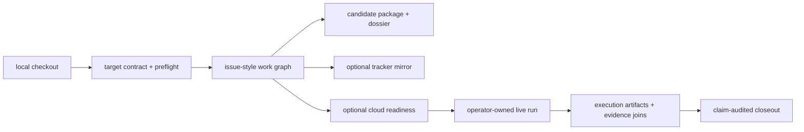

# Workflow guide

One BioProspector campaign contract covers local evaluation, tracker work,
provider readiness, and live closeout. Start with local artifacts. Reuse the
same ledgers after an operator approves tracker or compute work.



## Workflow chooser

| Workflow | Use it when | Main output | External services |
| --- | --- | --- | --- |
| Local first hour | You want to generate the demo dossier, campaign graph, candidate package, and route ranking. | Local outputs under `.runtime/local-demo/`. | None. |
| First campaign | You have a target and host but no campaign packet. | Target contract, manifest, ledgers, preflight, input audit. | None. |
| Agent work graph | You want an agent to split a broad campaign into reviewable lanes. | Markdown issue-style drafts with dependencies, budgets, kill criteria, and validation commands. | None by default. |
| Agent kickoff brief | You have Codex, Claude Code, Symphony with Linear, or a goal-oriented agent. | Prompt, local commands, lane counts, and safety boundaries. | None. |
| Linear/tracker mirror | Your team wants the work graph in Linear, GitHub Issues, Jira, or another tracker. | Reviewed Markdown drafts copied into external issues with closeout blocks. | Optional tracker after local review. |
| Cloud readiness | You may need RunPod, HPC, cloud VM, neocloud, managed workflow, or ElasticBLAST later. | Provider bundles, stage contracts, launch blockers, expected returned ledgers. | None from the generator. |
| Operator-owned live run | You already approved budget, data policy, credentials, storage, and cleanup outside the repository. | Compact execution artifacts, evidence joins, and maturity and claim checks. | User-managed provider environment. |
| Public release check | You want to publish a repository version. | Release gate, documentation checks, audits, and `gitleaks` output. | None required. |

## 1. Local first hour

Use this workflow to evaluate BioProspector. It checks that the repository can
build the core artifact chain without an external service.

```bash
python3 scripts/bioprospector_doctor.py --include-runtime
make local-demo
sed -n '1,80p' .runtime/local-demo/huperzine/dossier.md
```

You get:

- a campaign graph
- a metadata-only GeneCluster atlas plan
- synthetic Atlas contract validation
- candidate package ledgers
- Pareto route rankings
- a compact claim-bounded dossier

## 2. First campaign

Use this when you want a campaign packet for a new molecule and host. This creates
a scaffold the agent can use before it expands routes, mines enzyme
families, or drafts provider handoffs.

```bash
python3 scripts/bioprospector_new_campaign.py \
  --target-contract templates/target-contract.example.json \
  --out .runtime/scaffolds/example-target-v0 \
  --campaign-id example-target-v0

python3 scripts/bioprospector_preflight.py \
  --campaign .runtime/scaffolds/example-target-v0/campaign-manifest.json \
  --repo-root . \
  --scan-local-artifacts

python3 scripts/bioprospector_input_audit.py \
  --campaign .runtime/scaffolds/example-target-v0/campaign-manifest.json
```

Closeout fields:

- what is known
- what is assumed
- what operator decisions are still missing
- why the claim level is still planning-only

## 3. Agent work graph

Use this when a route or enzyme search is too broad for one prose answer. The
issue dry-run turns the campaign into an agent-readable work graph: route lanes,
enzyme-family sweeps, dark-step resolvers, candidate-intelligence tasks,
provider prep, review gates, and closeout commands.

```bash
python3 scripts/bioprospector_issue_dry_run.py \
  --campaign examples/nootkatone-yeast-v0/campaign-manifest.json \
  --prefix NOOTKATONE \
  --out .runtime/nootkatone-workgraph \
  --include-profile full-frontier
```

The generated Markdown stays local and supports these tasks:

- giving one agent a bounded next task
- reviewing dependencies before widening
- identifying provider-readiness blockers
- preserving rejected routes and weak claims
- copying a curated subset into Linear, GitHub Issues, Jira, or another tracker
- keeping long campaigns from collapsing into one unreviewable report

Example Nootkatone work graph:

| Lane | Purpose | Generated file pattern | Depends on | Typical status | Closeout artifact |
| --- | --- | --- | --- | --- | --- |
| Target contract | Normalize target, host, goals, and claim ceiling. | `00-target-contract*.md` | campaign manifest | first wave | updated manifest and input-audit rows |
| Route expansion | Keep natural, engineered, analog, and fallback routes visible. | `route-*.md` | target contract | first wave | `route-ledger.tsv` |
| Dark-step resolver | Split unknown chemistry into single-gene, multi-gene, and hidden-step hypotheses. | `dark-step-*.md` | route expansion | first wave for frontier routes | `unknown-step-ledger.tsv` |
| Enzyme-family sweep | Compress broad homology or family searches before candidate promotion. | `enzyme-family-*.md` | reaction steps | first wave for wide steps | `enzyme-family-sweep.tsv` |
| Candidate intelligence | Add variants, motifs, localization, PTM, cofactor, and close-canonical-match context. | `candidate-intelligence-*.md` | candidate families | backlog until candidates exist | `candidate-intelligence-ledger.tsv` |
| Candidate package | Convert compact hit summaries into package indexes, graph edges, and domain rows. | `candidate-package-*.md` | evidence lanes | backlog until search outputs exist | `run-output-package-ledger.tsv` |
| Provider readiness | Define future RunPod/HPC/cloud execution contracts without launching compute. | `provider-*.md` | search plan | blocked until operator review | readiness bundle under `.runtime/` |
| Pareto ranking | Rank routes for multiple criteria. | `ranking-*.md` | candidate package | first wave for examples | `pareto-frontier-ledger.tsv` |
| Red-team review | Preserve weak claims, killed routes, and promotion blockers. | `red-team-*.md` | route and candidate lanes | first wave | `red-team-report.md` |
| Dossier export | Package the campaign for human review and next-wave planning. | `dossier-*.md` | rankings and review lanes | final wave | `dossier.md` |

Generate a campaign-specific agent kickoff brief when the user already has an
orchestrator and needs a prompt, command list, lane counts, and boundaries:

```bash
python3 scripts/bioprospector_agent_brief.py \
  --campaign examples/huperzine-frontier-public-v0/campaign-manifest.json \
  --out .runtime/huperzine-agent-brief \
  --prefix HUPERZINE \
  --profile public-demo \
  --mode goal \
  --agent codex
```

The brief supplies a prompt, command list, lane counts, and boundaries. It does
not call trackers, launch cloud resources, or replace a Symphony with Linear workflow.

## 4. Linear or tracker mirror

Use this when a team wants the BioProspector work graph in Linear, GitHub
Issues, Jira, or another tracker. The public repository does not call tracker APIs.
Review and prune the local drafts first, then copy only the issues you want.

```bash
sed -n '1,220p' docs/symphony-linear-sidecar.md
ls .runtime/nootkatone-workgraph
```

Before creating external issues, confirm:

- no secrets, provider identifiers, private paths, or private sequence content
  appear in the issue body
- issue labels and project fields are local to your tracker
- most issues start in backlog
- only the first approved, contract-checked wave is active
- every issue keeps the `Claim Boundary`, `Search Budget`, and `Kill Criteria`

A tracker records dependencies, ownership, blockers, review gates, and closeout
comments. The local campaign contract and generated ledgers remain the source of
truth.

Tracker field mapping:

| Tracker field | BioProspector source |
| --- | --- |
| Title | Generated issue draft title and campaign prefix. |
| Labels | Campaign id, lane type, profile, provider/readiness tag if relevant. |
| Owner | Human or agent assigned after local review. |
| Status | `Backlog` by default; `Active` only for the first approved, contract-checked wave. |
| Dependencies and blockers | Draft `Depends On`, `Review Gate`, and provider-preflight rows. |
| Acceptance criteria | `Continuation Criteria`, `Kill Criteria`, and validation commands. |
| Closeout comment | Ledger rows changed, artifacts generated, claim level, blockers, and next lane. |
| Evidence links | Opaque sidecar identifiers, public accessions, checksums, and reviewed dossier references. |

## 5. Cloud readiness

Use this when local planning shows a future need for heavier search. Readiness
bundles convert a broad biological question into executable contracts: expected
inputs, stage boundaries, output ledgers, budgets, resume points, and proof rows.
The generator itself stays local; the future run happens only after an operator
chooses a provider environment.

RunPod-style readiness:

```bash
python3 scripts/bioprospector_runpod_bundle.py \
  --campaign examples/nootkatone-yeast-v0/campaign-manifest.json \
  --out .runtime/runpod-readiness/nootkatone-yeast-v0
```

AWS ElasticBLAST readiness:

```bash
python3 scripts/bioprospector_elasticblast_bundle.py \
  --campaign examples/nootkatone-yeast-v0/campaign-manifest.json \
  --out .runtime/elasticblast-readiness/nootkatone-yeast-v0 \
  --bucket-uri s3://REPLACE_ME_OPERATOR_APPROVED_BUCKET/biosymphony-elasticblast \
  --database nr \
  --budget-usd 25
```

Cloud readiness must answer:

- which provider role is needed
- what data may leave the local machine
- where raw/heavy outputs stay
- what compact ledgers return
- what budget, cleanup, quota, image, stage, and secrets gates block launch
- how a failed or partial provider run closes without losing candidate evidence

Provider chooser:

| Provider class | Best use | Readiness artifact | What returns | Avoid when |
| --- | --- | --- | --- | --- |
| `local_lite` | Doctor, preflight, demos, issue drafts, tiny path checks. | local command output | `.runtime/` sidecars and dossiers | You need real heavy search. |
| `local_full` | User-owned hardware with external workdirs. | stage contract plus external path policy | compact ledgers and checksums | The run cannot keep raw data outside Git. |
| `runpod_manual_pod` | Controlled heavy search and candidate compression. | RunPod readiness bundle | package ledgers, proof rows, summaries | Image, volume, budget, or auth is not ready. |
| `ssh_hpc` | Institutional cluster or rented SSH machine. | provider-preflight rows and workflow contract | stage progress and artifact ledger rows | Scheduler/output handoff cannot emit ledgers. |
| `cloud_vm` or `neocloud_vm` | Flexible CPU/GPU jobs, candidate-intelligence tools, or workflow runners. | provider-preflight rows and stage contracts | compact result package and tool proof | Egress, secrets, or storage policy is unclear. |
| `managed_workflow` | Repeatable production-style runs. | workflow-framework ledger | normalized workflow artifacts and proof rows | Wrappers cannot emit BioProspector ledgers. |
| `elasticblast_cloud` | Official NCBI BLAST database escalation. | ElasticBLAST readiness bundle | compressed BLAST evidence lanes | Cheaper local/RunPod lanes are sufficient. |

## 6. Operator-owned live cloud run

BioProspector can describe a live cloud run as a structured handoff: launch
contract, stage progress, execution artifacts, evidence joins, controls, and
claim closeout. The actual run belongs in an operator-managed environment after
budget, credentials, storage, data rights, and cleanup are approved outside this
repository.

Before launch:

- `stage-contract-ledger.tsv` has expected outputs, timeouts, checkpoints, done
  markers, resume commands, and fail-closed behavior
- `provider-launch-preflight-ledger.tsv` has no blocking rows
- query and input rows use public accessions or opaque external pointers managed outside the repository
- credentials stay in provider-side secret stores or user shells, never in repository
  files, chat, or tracker issues

After launch, do not declare success from provider state. Join back:

- `stage-progress-ledger.tsv`
- `execution-artifact-ledger.tsv`
- `target-evidence-ledger.tsv`
- `decoy-control-ledger.tsv`
- `run-maturity-ledger.tsv`

Closeout packet contains:

- promoted, parked, and killed candidates
- route rankings and rationale
- joined target evidence and decoy controls
- provider artifact index with checksums or reviewed placeholder identifiers
- partial/degraded result rows if a lane stopped early
- next-wave issue drafts or tracker closeout comments
- dossier identifier and claim level

Strict live closeout:

```bash
python3 scripts/bioprospector_contract_self_check.py \
  --campaign path/to/live/campaign-manifest.json \
  --require-real-execution \
  --require-target-evidence \
  --require-decoy-controls \
  --require-maturity L5
```

## 7. Public release check

Use this when preparing a public release while still staying
local.

```bash
make release-check
gitleaks dir . --no-banner --redact --verbose
gitleaks detect --source . --no-banner --redact --verbose
```

This checks the repository, not biological truth. It says the public skill repo
is clean enough to review as a release candidate.
