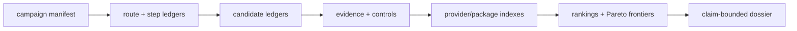

# Dossier Schema

BioProspector dossiers are table-first. Freeform reports are allowed only when they summarize structured ledgers.

The final dossier is the claim-audited closeout index over genes, candidate
sequences, clusters, rankings, analyses, rejected evidence, provenance, and
route decisions. Full approved protein AA candidate sequence packs and heavy
analysis artifacts live provider-side; the public repo keeps compact
indexes, checksums, accessions, graph edges, and external pointers.



## Required Files

```text
bioprospector-dossier/
  target-contract.json
  route-ledger.tsv
  reaction-step-ledger.tsv
  candidate-funnels.tsv
  enzyme-draft-board.tsv
  route-stitching-scorecard.tsv
  claim-ledger.md
  red-team-report.md
  validation-roadmap.md
```

Campaign manifests must list the core ledger paths under `ledgers`:

- `route_ledger`
- `reaction_step_ledger`
- `candidate_funnels`
- `enzyme_draft_board`
- `route_stitching_scorecard`
- `resource_ledger`
- `claim_ledger`

Campaigns may also list optional or campaign-required artifacts under `ledgers`:

- `unknown_step_ledger`
- `rejected_candidates`
- `provenance_log`
- `runpod_run_manifest`
- `elasticblast_search_plan`
- `elasticblast_run_ledger`
- `aws_safety_ledger`
- `literature_ledger`
- `literature_search_ledger`
- `pathway_inference_ledger`
- `unknown_gene_hypothesis_ledger`
- `enzyme_family_sweep`
- `sequence_search_plan_ledger`
- `candidate_sequence_ledger`
- `domain_annotation_ledger`
- `candidate_intelligence_ledger`
- `candidate_diversity_ledger`
- `candidate_graph_ledger`
- `run_output_package_ledger`
- `tool_registry_ledger`
- `adapter_contract_ledger`
- `evidence_event_ledger`
- `candidate_ranking_ledger`
- `pareto_frontier_ledger`
- `genome_mining_plan`
- `genome_hit_ledger`
- `structure_risk_ledger`
- `host_comparison_ledger`
- `assay_handoff_ledger`
- `monitoring_ledger`
- `self_learning_skill_ledger`
- `lane_status_ledger`
- `fanout_estimate_ledger`
- `partial_summary_ledger`
- `stale_output_guard_ledger`
- `input_audit_ledger`
- `operator_intake_ledger`
- `run_maturity_ledger`
- `stage_contract_ledger`
- `stage_progress_ledger`
- `tool_execution_proof_ledger`
- `organism_sample_ledger`
- `query_set_ledger`
- `target_dataset_ledger`
- `target_evidence_ledger`
- `decoy_control_ledger`
- `execution_artifact_ledger`
- `compute_provider_ledger`
- `provider_launch_preflight_ledger`
- `workflow_framework_ledger`
- `supply_chain_preflight_ledger`
- `route_rule_ledger`
- `thermodynamics_ledger`
- `metabolic_model_ledger`
- `strain_design_ledger`
- `chemoenzymatic_fallback_ledger`
- `bgc_context_ledger`
- `metagenome_context_ledger`
- `metabolomics_evidence_ledger`
- `compound_source_ledger`
- `mag_quality_ledger`
- `eukaryotic_annotation_ledger`
- `genecluster_source_scout_ledger`
- `genecluster_route_decision_ledger`
- `genecluster_atlas_contract_ledger`
- `genecluster_cluster_calls`
- `genecluster_bgc_consensus`
- `genecluster_protein_function_votes`
- `genecluster_protein_function_jury`

Use a top-level `required_ledgers` array when one of the optional artifacts is mandatory for a campaign. This keeps the starter vanillin dossier valid while letting frontier demos, such as nootkatone-route work, require unknown-step, ambiguity, family-sweep, genome-context, structure-risk, host-fit, rejection, provenance, RunPod handoff, or ElasticBLAST handoff artifacts.

The validator only reads local files and metadata. It must not download databases, accessions, model weights, sequences, or remote artifacts.

## TSV Header Contracts

`unknown_step_ledger` must use:

```text
unknown_step_id	parent_step_id	route_id	gap_type	substrate	product	transformation_hypothesis	search_strategy	candidate_search_width	status	required_evidence	notes
```

`rejected_candidates` must use:

```text
candidate_id	step_id	candidate_name	source_organism	accession_or_source	rejection_stage	claim_level	rejection_reason	evidence_classes	reviewer	notes
```

`elasticblast_search_plan` must use:

```text
search_id	step_id	query_set	program	database	cloud_provider	region	result_uri	num_nodes	use_preemptible	thresholds	max_hits	budget_usd	approval_status	notes
```

`elasticblast_run_ledger` must use:

```text
run_id	search_id	status	submitted_at	completed_at	cloud_provider	region	result_uri	cleanup_status	estimated_cost_usd	output_summary	notes
```

`aws_safety_ledger` must use:

```text
control_id	control_type	control_name	required_status	verification_mode	verification_command	blocking_before_submit	last_verified	owner	notes
```

`literature_ledger` must use:

```text
citation_id	source_type	identifier_or_url	claim_supported	evidence_class	license_boundary	used_in_claim_ids	notes
```

`literature_search_ledger` must use:

```text
search_id	step_id	topic	sources	query_terms	recency_window_days	result_cap	status	output_contract	notes
```

`pathway_inference_ledger` must use:

```text
hypothesis_id	parent_hypothesis_id	route_id	evidence_sources	inference_method	assumption	counterevidence	claim_level	decision	notes
```

`unknown_gene_hypothesis_ledger` must use:

```text
hypothesis_id	parent_step_id	route_id	proposed_gene_or_module	enzyme_class_or_role	hypothesis_type	evidence_for	evidence_against	claim_level	next_discriminating_step	status	notes
```

`enzyme_family_sweep` must use:

```text
family_id	step_id	seed_accessions	family_scope	domain_model	motifs_required	raw_hits	clusters	representatives	known_activity_refs	risk	next_lane	notes
```

`sequence_search_plan_ledger` must use:

```text
search_id	step_id	query_id	search_tool	database	provider_id	remote_workdir	sequence_scope	max_hits	thresholds	budget_usd	approval_status	output_contract	notes
```

`candidate_sequence_ledger` must use:

```text
candidate_id	step_id	sequence_type	sequence_pointer	aa_length	checksum_or_version	source_database	license_boundary	domain_map_status	notes
```

`domain_annotation_ledger` must use:

```text
annotation_id	candidate_id	step_id	domain_source	domain_accession	domain_name	domain_start	domain_end	motif_or_active_site	confidence	notes
```

`candidate_intelligence_ledger` must use:

```text
intelligence_id	candidate_id	step_id	intelligence_type	source_scope	evidence_source	inference_basis	finding	confidence	claim_level	actionability	notes
```

`self_learning_skill_ledger` must use:

```text
learning_id	date	campaign_id	trigger	hiccup_type	observation	hypothesis	probe_or_experiment	control_or_baseline	expected_signal	stop_loss	result	decision	runbook_update	skill_update	reusable_guardrail	claim_boundary	owner	notes
```

`candidate_diversity_ledger` must use:

```text
selection_id	step_id	candidate_id	diversity_axis	cluster_or_clade	novelty_level	host_fit_priority	selection_status	rationale	notes
```

`candidate_graph_ledger` must use:

```text
edge_id	source_id	target_id	edge_type	step_id	evidence_class	weight	claim_level	notes
```

`run_output_package_ledger` must use:

```text
package_id	package_type	included_ledgers	graph_artifact	sequence_policy	location_or_pointer	status	notes
```

`tool_registry_ledger` must use:

```text
tool_id	tool_name	tool_class	adapter_id	adapter_version	supported_event_types	input_policy	output_policy	private_data_policy	license_boundary	default_provider_classes	status	notes
```

`adapter_contract_ledger` must use:

```text
adapter_id	tool_id	contract_version	input_formats	output_event_schema	required_columns	rejected_input_patterns	privacy_guards	deterministic_id_policy	failure_mode	status	notes
```

`evidence_event_ledger` must use:

```text
event_id	event_type	campaign_id	run_id	step_id	candidate_id	query_id	source_tool_id	adapter_id	source_scope	evidence_class	evidence_type	evidence_pointer	metrics_json	claim_level	join_status	license_boundary	checksum_or_version	raw_data_retained	private_data_status	notes
```

`tool_execution_proof_ledger` must use:

```text
proof_id	run_id	tool_id	adapter_id	provider_id	command_or_workflow	tool_version	database_or_model_version	started_at	completed_at	exit_status	stdout_summary_pointer	stderr_summary_pointer	artifact_ids	dry_run	mock_tools	status	checksum_or_summary	notes
```

`candidate_ranking_ledger` must use:

```text
rank_id	step_id	candidate_id	rank	score	rank_basis	evidence_summary	caveats	claim_level	package_id	notes
```

`pareto_frontier_ledger` must use:

```text
frontier_id	route_id	lens	rank	score	rationale	candidate_ids	blocking_gaps	claim_level	package_id	notes
```

`genome_mining_plan` must use:

```text
search_id	target_taxa	database_or_source	query_family	anchor_gene	neighborhood_window	budget_usd	approval_status	notes
```

`genome_hit_ledger` must use:

```text
hit_id	search_id	accession_or_locus	organism	contig	coordinates_or_pointer	domain_call	neighborhood_support	claim_level	notes
```

`structure_risk_ledger` must use:

```text
risk_id	candidate_id	structure_source	confidence	active_site_residues	cofactor_or_membrane_risk	substrate_access_risk	oligomerization_risk	claim_boundary	verdict	notes
```

`host_comparison_ledger` must use:

```text
host	route_id	step_id	burden	precursor_fit	compartment_fit	toxicity	analytics_fit	verdict	notes
```

`assay_handoff_ledger` must use:

```text
design_id	route_id	candidate_ids	measurable_product	assay_readout	controls_needed	risk	non_protocol_boundary	claim_boundary	notes
```

`monitoring_ledger` must use:

```text
run_id	issue_id	lane	expected_artifact	heartbeat_status	blocker	next_review_at	owner	notes
```

`input_audit_ledger` must use:

```text
input_id	input_class	declared_in	expected_artifact	materialized_status	location_or_pointer	checksum_or_version	operator_required	missing_operator_item	notes
```

`operator_intake_ledger` must use:

```text
intake_id	input_area	prompt	default_assumption	operator_answer	confirmation_status	required_before	planning_can_proceed	skip_allowed	notes
```

`run_maturity_ledger` must use:

```text
run_id	maturity_level	level_name	status	evidence_artifact	blocking_gap	reviewer	notes
```

`stage_contract_ledger` must use:

```text
stage_id	stage_name	provider_id	expected_artifact	checkpoint_marker	done_marker	timeout_minutes	resume_command	fail_closed	required_for_maturity	status	notes
```

`stage_progress_ledger` must use:

```text
event_id	stage_id	event_status	timestamp	artifact_pointer	heartbeat_age_minutes	fallback_from	fallback_to	degraded_status	notes
```

`organism_sample_ledger` must use:

```text
organism_id	taxon_name	strain_or_accession	sample_id	role	evidence_type	data_status	source_pointer	license_boundary	notes
```

`query_set_ledger` must use:

```text
query_id	step_id	query_type	query_label	source_organism	source_pointer	materialized_status	checksum_or_version	license_boundary	notes
```

`target_dataset_ledger` must use:

```text
dataset_id	organism_id	dataset_type	dataset_label	source_pointer	materialized_status	checksum_or_version	target_evidence_role	license_boundary	notes
```

`target_evidence_ledger` must use:

```text
evidence_id	candidate_id	step_id	organism_id	dataset_id	evidence_type	evidence_pointer	join_status	claim_level	notes
```

`decoy_control_ledger` must use:

```text
control_id	step_id	control_type	query_or_dataset	expected_result	observed_result	status	blocks_promotion	notes
```

`execution_artifact_ledger` must use:

```text
artifact_id	run_id	step_id	command_or_issue	artifact_type	path_or_uri	produced_by	dry_run	mock_tools	status	checksum_or_summary	notes
```

`compute_provider_ledger` must use:

```text
provider_id	provider_class	provider_name	role	launch_mode	storage_root	workdir_template	secrets_boundary	cost_boundary_usd	status	blessed_path	notes
```

`provider_launch_preflight_ledger` must use:

```text
check_id	provider_id	check_type	expected	observed	status	blocking_before_launch	notes
```

`workflow_framework_ledger` must use:

```text
framework_id	framework_class	use_case	provider_classes	entrypoint_or_template	provenance_mode	resume_supported	status	notes
```

`lane_status_ledger` must use:

```text
lane_id	stage_id	lane_type	evidence_role	step_id	primary_output	status	partial_allowed	blocks_campaign_success	claim_level	notes
```

`fanout_estimate_ledger` must use:

```text
estimate_id	stage_id	lane_id	step_id	input_unit	input_count	expansion_factor	estimated_items	estimated_runtime_minutes	estimated_cost_usd	decision	status	notes
```

`partial_summary_ledger` must use:

```text
summary_id	run_id	stage_id	lane_id	summary_pointer	written_at	status	completed_items	failed_items	deferred_items	claim_level	resume_pointer	notes
```

`stale_output_guard_ledger` must use:

```text
guard_id	stage_id	artifact_id	input_hash	code_hash	output_hash	done_marker	validation_status	stale_check_status	notes
```

`supply_chain_preflight_ledger` must use:

```text
check_id	provider_id	image_ref	resolved_digest	artifact_kind	tool	tool_version	command	evidence_pointer	status	blocking_before_launch	checksum_or_summary	policy_decision	notes
```

`route_rule_ledger` must use:

```text
rule_id	route_id	step_id	tool_name	rule_source	reaction_query	substrate	product	proposed_transformation	enzyme_or_ec_hint	confidence	license_boundary	output_pointer	claim_level	decision	notes
```

`thermodynamics_ledger` must use:

```text
thermo_id	route_id	step_id	tool_name	reaction_reference	ph	ionic_strength	delta_g_prime_kj_mol	uncertainty_kj_mol	concentration_assumptions	feasibility_verdict	claim_level	output_pointer	notes
```

`metabolic_model_ledger` must use:

```text
model_id	host	route_id	tool_name	model_source	model_version	media_or_context	precursor_supply	cofactor_supply	byproduct_or_sink_risk	gap_status	feasibility_verdict	output_pointer	claim_level	notes
```

`strain_design_ledger` must use:

```text
design_id	host	route_id	tool_name	model_id	objective	intervention_type	intervention_summary	expected_effect	risk	approval_status	non_protocol_boundary	claim_level	output_pointer	notes
```

`chemoenzymatic_fallback_ledger` must use:

```text
fallback_id	route_id	step_id	tool_name	fallback_type	input_molecule	target_molecule	proposed_step_or_route	enzyme_dependency	chemistry_dependency	feasibility_verdict	why_needed	claim_level	output_pointer	notes
```

`bgc_context_ledger` must use:

```text
bgc_context_id	step_id	tool_name	source_accession_or_id	organism_or_sample	cluster_pointer	anchor_genes_or_domains	product_class_prediction	family_or_novelty_placement	visualization_pointer	claim_level	evidence_role	notes
```

`metagenome_context_ledger` must use:

```text
context_id	step_id	dataset_id	contig_or_mag_pointer	public_private_status	tool_name	bgc_or_gcf_assignment	abundance_or_expression_summary	quality_or_taxonomy_summary	target_evidence_role	decoy_control_status	claim_level	notes
```

`metabolomics_evidence_ledger` must use:

```text
metabolomics_id	sample_id	feature_or_spectrum_id	source_file_pointer	mz_rt_adduct_summary	tool_name	network_or_component_id	library_or_analog_hit	score_or_confidence	target_or_intermediate_relationship	upload_policy_status	claim_level	notes
```

`compound_source_ledger` must use:

```text
compound_source_id	compound_id	source_organism_or_taxon	structure_identifier	natural_product_class	citation_or_url	license_boundary	prior_type	claim_level	notes
```

`mag_quality_ledger` must use:

```text
mag_quality_id	dataset_id	mag_or_contig_set	tool_name	completeness	contamination	taxonomy_summary	quality_verdict	target_evidence_role	notes
```

`eukaryotic_annotation_ledger` must use:

```text
annotation_id	dataset_id	tool_name	organism_or_sample	gene_model_pointer	evidence_inputs	annotation_status	license_boundary	claim_level	notes
```

`genecluster_source_scout_ledger` must use:

```text
source_id	organism_id	taxon_name	source_record_type	source_provider	source_pointer	material_type	acquisition_policy	has_genome	has_annotation	has_proteome	has_transcriptome	scout_status	claim_ceiling	notes
```

`genecluster_route_decision_ledger` must use:

```text
route_id	organism_id	taxon_name	recommended_route	route_status	claim_ceiling	blockers	accepted_inputs	rejected_routes	notes
```

`genecluster_atlas_contract_ledger` must use:

```text
contract_id	contract_type	required_inputs	expected_artifacts	validation_command	raw_artifact_policy	claim_boundary	status	notes
```

`genecluster_cluster_calls` must use:

```text
cluster_id	caller	source_species	target_species	contig	start	end	core_genes	confidence	claim_level
```

`genecluster_bgc_consensus` must use:

```text
consensus_id	cluster_id	verdict	caller_count	agreeing_callers	disagreeing_callers	disagreement_status	claim_level	caller_versions	caller_licenses
```

`genecluster_protein_function_votes` must use:

```text
protein_id	tool	function_label	confidence	evidence_level	tool_version	license
```

`genecluster_protein_function_jury` must use:

```text
protein_id	verdict	claim_level	supporting_tools	contradicting_tools	confidence
```

ElasticBLAST ledgers are planning and run-control artifacts. They must not
contain AWS credentials, uploaded query sequences, large result files, or copied
BLAST database content.

Sequence-search and candidate-package ledgers are output contracts, not raw data
containers. They may hold AA sequence pointers, checksums, accessions, domain
spans, motif summaries, candidate-intelligence rows, graph edges, package paths,
and citation summaries. They must not hold raw all-hit BLAST output, database
mirrors, unrestricted FASTA dumps, nucleotide constructs, full-text literature,
model weights, or private sequence data.

Adapter and evidence-event ledgers normalize compact outputs from BLAST6,
DIAMOND/MMseqs2, HMMER, Foldseek, Rhea, genome-context/BGC tools, literature
summaries, or provider workflows. They are adapter contracts and event indexes,
not vendored tools or live-compute artifacts. `raw_data_retained` must be
`false` for repo-tracked events.

Candidate ranking and Pareto frontier ledgers must be derived from joined
candidates, clusters, evidence, controls, host-fit, route context, and package
indexes. They preserve several useful winners instead of forcing one route:
minimal genes, highest evidence, clearest validation handoff, best host fit, ambitious
route, and diversity-library options.

Candidate-intelligence rows capture ranking-useful interpretation such as
publicly reported reference enzymes, variant annotations, signal peptides,
transit peptides, transmembrane regions, localization, PTM/glycosylation
watchouts, cofactors, oligomer state, motifs, expression context, and close
canonical-match inferences. They are not docking, wet-lab assay design,
construct recipes, or target-host validation.

Self-learning skill rows capture process lessons from hiccups. They may reference
logs, compact provider summaries, failed validation output, and durable
runbook/skill/template/validator changes. They must not contain secrets, private
sequence data, raw all-hit outputs, full FASTA dumps, database mirrors, or
full-text literature. They do not satisfy biological evidence, provider
readiness, execution, or final claim gates.

Ambiguity, genome-context, structure-risk, host-fit, assay-handoff, and
monitoring ledgers are planning artifacts. They must not contain raw FASTA/GFF,
BLAST databases, genome archives, model weights, wet-lab procedures, construct
sequences, or private/unpublished sequence data.

Input-audit, operator-intake, maturity, target-evidence, decoy-control, and
execution-artifact ledgers prevent false success. They distinguish declared
inputs from materialized inputs, reversible planning assumptions from execution
approval, reference hits from target organism/sample evidence, mock artifacts
from real execution artifacts, and planned controls from passed controls.

Stage-contract, stage-progress, and provider-launch-preflight ledgers prevent
long-run and cloud/provider false success. They distinguish provider intent
from container/workflow progress, private image pull readiness from image names,
and partial/fallback execution from complete execution.

Opportunity-lane ledgers are contracts for powerful optional tools. Supply-chain
rows gate image readiness. Route-rule, thermodynamic, model, strain-design,
fallback, BGC, metagenome, metabolomics, source-prior, MAG-quality, and
eukaryotic-annotation rows are planning or context evidence until joined to
execution artifacts, target evidence, controls, and claim audits.

GeneCluster atlas ledgers are summary contracts only. They may include public
accession-style pointers, caller names, coordinates over public/placeholder
assemblies, function-vote summaries, claim ceilings, and compact jury verdicts.
They must not include raw FASTA/GFF/FASTQ/SRA/BAM files, database mirrors,
provider traces, credentials, or unpublished sequence content.

Compute-provider and workflow-framework ledgers preserve portability. RunPod is
the reviewed default provider path, while AWS ElasticBLAST, local-full, cloud,
neocloud, HPC, and managed workflow backends may be approved only for bounded
compatible or escalation roles that still emit the same BioProspector ledgers
and self-check artifacts.

## Claim Levels

Use only these claim levels:

- `hypothesis`
- `domain_supported`
- `ortholog_supported`
- `evidence_supported`
- `characterized_elsewhere`
- `validated_elsewhere`
- `validated_in_target`
- `rejected`

## Maturity Levels

Use these levels to avoid collapsing planning, execution, evidence, and claims:

- `L0`: plan exists
- `L1`: tools ready
- `L2`: inputs/materialized
- `L3`: execution performed
- `L4`: evidence joined
- `L5`: claim-audited dossier

`L3` requires a materialized execution artifact where `dry_run=false` and
`mock_tools=false`; when a tool proof ledger is declared, it also requires a
materialized non-mock, non-dry-run proof row. `L4` requires evidence rows that
join candidate, step, organism/sample, and dataset. `L5` requires the final
contract self-check and claim audit to pass under the campaign's required
flags, with materialized provider-side package indexes, sequence checksums,
cluster/diversity membership, and no pending evidence-event joins.

## Evidence Classes

Candidate rows may use:

- `literature`
- `accession`
- `sequence_similarity`
- `domain`
- `motif`
- `phylogeny`
- `structure`
- `substrate`
- `kinetics`
- `host_fit`
- `route_stitching`
- `red_team`

## Candidate Intelligence Values

`candidate_intelligence_ledger.intelligence_type` may use:

- `public_reference_enzyme`
- `engineered_variant`
- `mutant_variant`
- `natural_variant`
- `signal_peptide`
- `transit_peptide`
- `transmembrane`
- `ptm`
- `localization`
- `motif`
- `cofactor`
- `oligomer`
- `expression_context`
- `canonical_inference`
- `counterevidence`
- `other`

`candidate_intelligence_ledger.source_scope` may use:

- `public_reviewed`
- `public_unreviewed`
- `literature`
- `close_canonical_match`
- `candidate_sequence`
- `template_design`
- `provider_summary`
- `operator_supplied`
- `other`

`candidate_intelligence_ledger.actionability` may use:

- `use_as_anchor`
- `prioritize`
- `deprioritize`
- `review`
- `preserve`
- `park`
- `block`
- `not_applicable`

## Self-Learning Skill Values

`self_learning_skill_ledger.hiccup_type` may use:

- `planning_gap`
- `input_gap`
- `provider_failure`
- `tool_failure`
- `stale_progress`
- `false_success_risk`
- `evidence_ambiguity`
- `scale_fanout`
- `fallback`
- `cost_overrun`
- `data_policy_risk`
- `claim_boundary`
- `other`

`self_learning_skill_ledger.decision` may use:

- `keep`
- `update_runbook`
- `update_skill`
- `update_template`
- `add_validator`
- `add_preflight`
- `add_issue_lane`
- `park`
- `retry`
- `stop`
- `escalate`
- `no_change`

`runbook_update`, `skill_update`, and `reusable_guardrail` must be `true` or
`false`.

## Route Status Values

- `seed`
- `expanded`
- `under_review`
- `shortlisted`
- `killed`
- `needs_missing_step`

## Search Width Values

- `tiny`
- `narrow`
- `medium`
- `wide`
- `frontier`

Use `frontier` only when the issue has an explicit runtime and candidate-count budget.

## Additional Controlled Values

`pathway_inference_ledger.decision` may use:

- `open`
- `continue`
- `split`
- `parked`
- `killed`
- `promote`
- `needs_evidence`

`unknown_gene_hypothesis_ledger.status` may use:

- `open`
- `review`
- `shortlisted`
- `rejected`
- `parked`
- `killed`

`structure_risk_ledger.verdict` may use:

- `unknown`
- `review`
- `pass`
- `watch`
- `blocked`
- `reject`

`host_comparison_ledger.verdict` may use:

- `unknown`
- `review`
- `preferred`
- `acceptable`
- `risky`
- `blocked`

`monitoring_ledger.heartbeat_status` may use:

- `planned`
- `waiting`
- `running`
- `blocked`
- `stale`
- `stalled`
- `complete`
- `not_started`

`operator_intake_ledger.input_area` may use:

- `target`
- `host`
- `scope`
- `inputs`
- `data_policy`
- `provider`
- `budget`
- `success_criteria`
- `claim_boundary`
- `unknowns`

`operator_intake_ledger.confirmation_status` may use:

- `unasked`
- `assumed`
- `confirmed`
- `skipped`
- `needs_operator`
- `blocked`

`operator_intake_ledger.required_before` may use:

- `planning`
- `execution`
- `claim_closeout`
- `never`

`operator_intake_ledger.planning_can_proceed` and
`operator_intake_ledger.skip_allowed` must be `true` or `false`.

`stage_contract_ledger.status` may use:

- `planned`
- `ready`
- `running`
- `completed`
- `failed`
- `partial`
- `skipped`
- `blocked`

`stage_contract_ledger.required_for_maturity` may use `L0` through `L5` or
`never`. `stage_contract_ledger.fail_closed` must be `true` or `false`.

`stage_progress_ledger.event_status` may use:

- `started`
- `heartbeat`
- `completed`
- `failed`
- `partial`
- `fallback`
- `skipped`
- `resumed`
- `stalled`

`stage_progress_ledger.degraded_status` may use:

- `none`
- `partial`
- `degraded`
- `blocked`
- `stalled`

`compute_provider_ledger.provider_class` may use:

- `local_lite`
- `local_full`
- `runpod_manual_pod`
- `runpod_ssh_pod`
- `ssh_hpc`
- `cloud_vm`
- `neocloud_vm`
- `managed_workflow`
- `elasticblast_cloud`
- `other`

If `compute_provider_ledger` is present, at least one `runpod_*` row must have
`blessed_path=true` and an active status (`planned`, `review_required`, or
`approved`). Non-default rows may use `blessed_path=true` only for a bounded
compatible or escalation role:

- `elasticblast_cloud` with `role=wide_blast_escalation` or `role=blessed_escalation`
- `neocloud_vm`, `cloud_vm`, `ssh_hpc`, `local_full`, or `managed_workflow` with
  `role=blessed_compatible` or `role=blessed_escalation`

`provider_launch_preflight_ledger.check_type` may use:

- `image_digest_pin`
- `registry_auth`
- `image_pull`
- `network_volume`
- `workdir`
- `cost_guardrail`
- `secrets_boundary`
- `branch_snapshot`
- `provider_payload_size`
- `issue_body`
- `data_policy`
- `stage_contract`
- `tool_execution_proof`
- `candidate_intelligence_tools`
- `public_api_access`
- `provider_egress_policy`
- `no_progress_stop_loss`

`provider_launch_preflight_ledger.status` may use:

- `planned`
- `pass`
- `fail`
- `blocked`
- `review_required`
- `not_applicable`

`provider_launch_preflight_ledger.blocking_before_launch` must be `true` or
`false`. Any live execution path should fail closed until all blocking rows pass.

`workflow_framework_ledger.framework_class` may use:

- `shell_script`
- `python_cli`
- `nextflow`
- `snakemake`
- `cwl`
- `wdl`
- `notebook`
- `managed_workflow`
- `manual`
- `other`

`workflow_framework_ledger.provider_classes` may list provider classes separated
by semicolons or use `all_providers`. If the ledger is present, at least one
active row must support a `runpod_*` provider class or `all_providers`.

`tool_registry_ledger.tool_class` may use:

- `sequence_search`
- `domain_search`
- `structure_search`
- `reaction_reference`
- `genome_context`
- `bgc_mining`
- `literature_search`
- `candidate_intelligence`
- `workflow_runner`
- `repository_security`
- `provenance`
- `other`

`tool_registry_ledger.status` and `adapter_contract_ledger.status` may use
`planned`, `active`, `deprecated`, `blocked`, or `review_required`.

`evidence_event_ledger.event_type` may use:

- `sequence_hit`
- `domain_hit`
- `structure_neighbor`
- `reaction_reference`
- `genome_context`
- `bgc_cluster`
- `literature_claim`
- `candidate_intelligence`
- `decoy_result`
- `tool_proof`
- `package_index`
- `ranking`
- `other`

`evidence_event_ledger.private_data_status` may use `none`, `redacted`,
`external_pointer_only`, or `blocked`. `tool_execution_proof_ledger.status` may
use `planned`, `materialized`, `partial`, `blocked`, or `failed`.

## Local Artifact Scan

Run the optional no-heavy-artifact scan before declaring a repo ready:

```bash
python3 scripts/bioprospector_preflight.py \
  --campaign examples/vanillin-yeast-v0/campaign-manifest.json \
  --repo-root . \
  --scan-local-artifacts
```

The scan fails on raw or heavy biological data patterns such as FASTA/FASTQ, BAM/CRAM/SAM, VCF, GFF/GTF, BLAST/MMseqs database shards, structure files, model weights, biological database archives, and large local files. It ignores runtime and build locations such as `.runtime/`, `build/`, `dist/`, `node_modules/`, virtualenvs, caches, and `.git/`.
